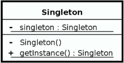
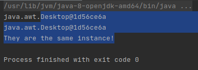
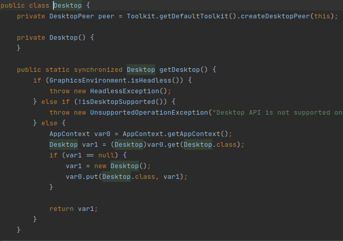
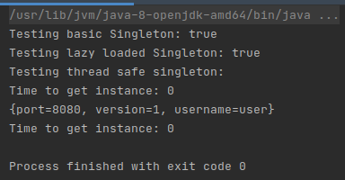
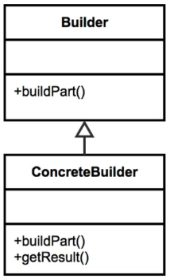
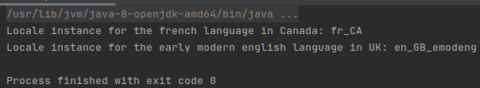
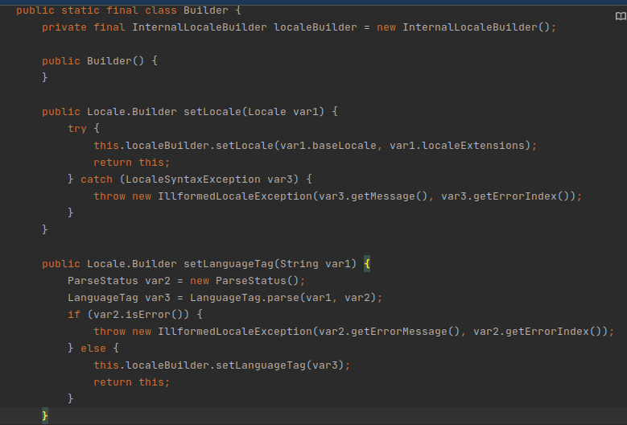
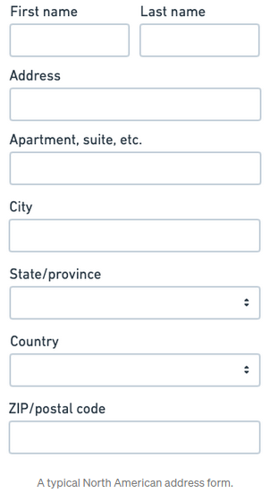

author: Drăghici Marius-Robert
title: Design Patterns codelab
summary: A codelab about Design Patterns
categories: Java
environments: Java
status: draft
id: design-patterns-codelab
feedback link: https://github.com/robert-marius-draghici/my-codelabs/issues

# Design Patterns

## Introduction to Design Patterns
Duration: 1

Hello and welcome to this codelab about design patterns. In this codelab, you will learn what are these design patterns, how many types there are and how to apply each of them in a real world setting. This codelab is partly inspired by the "Design Patterns in Java" course taught by Bryan Hansen on Pluralsight.

## What are Design Patterns?
Duration: 3

In software engineering, a design pattern is a general repeatable solution to a commonly occurring problem in software design. A design pattern isn't a finished design that can be transformed directly into code. It is a description or template for how to solve a problem that can be used in many different situations. Each pattern is like a blueprint that you can customize to solve a particular design problem in your code.

Design patterns can speed up the development process by providing tested, proven development paradigms. Effective software design requires considering issues that may not become visible until later in the implementation. Reusing design patterns helps to prevent subtle issues that can cause major problems and improves code readability for coders and architects familiar with the patterns.

Often, people only understand how to apply certain software design techniques to certain problems. These techniques are difficult to apply to a broader range of problems. Design patterns provide general solutions, documented in a format that doesn't require specifics tied to a particular problem.

In addition, patterns allow developers to communicate using well-known, well understood names for software interactions. Common design patterns can be improved over time, making them more robust than ad-hoc designs. 

## Design Patterns Classification
Duration: 5

Over 20 years ago the iconic computer science book "Design Patterns: Elements of Reusable Object-Oriented Software" was first published. The four authors of the book: Erich Gamma, Richard Helm, Ralph Johnson and John Vlissides, have since been dubbed "The Gang of Four". In technology circles, you'll often see this nicknamed shorted to GoF.

The GoF wrote the book in a C++ context but it still remains very relevant to Java programming, since C++ and Java are both object-oriented languages. The GoF authors, through their experience in coding large scale enterprise systems using C++, saw common patterns emerge. These design patterns are not unique to C++ and can be applied in any object oriented language.

The Gang of Four have grouped these design patterns into three categories:
- Creational Design Patterns for the creation of objects. 
- Structural design patterns to provide relationship between objects.
- Behavioral design patterns to help define how objects interact.

The rest of this codelab is divided into three parts, one for each design pattern category.

## Part 1: Creational Design Patterns
Duration: 3

The Creational design patterns, as the name suggests, are about class instantiation. This pattern can be further divided into class-creation patterns and object-creational patterns. While class-creation patterns use inheritance effectively in the instantiation process, object-creation patterns use delegation effectively to get the job done.

In this codelab, we will study the following creational design patterns:
- Singleton. Ensures only one instance of an object is created.
- Builder. Used to create complex objects.
- Prototype. Creates a new object from an existing object.
- Factory Method. Creates objects without specifying the exact class to create.
- Abstract Factory. Allows the creation of objects without specifying their concrete type.

## Singleton
Duration: 15

The Singleton design pattern is one of the most widely used design patterns due to its simplicity and the problem it solves.

### Definition

The purpose of the Singleton pattern is to ensure that only one instance of an object is created. Since the instantiation of this object is handled by the pattern, it also guarantees the control of a resource created as a Singleton. Usually, it is lazily loaded, which means that the initialization of an object is deffered until the point at which it is needed.

### Examples in the Java API:

- Runtime environment
- Logger, however depending on the implementation, it can also be a Factory
- Spring Beans
- Graphic Managers

### Design



In order to implement the Singleton pattern, there are some design considerations that we have to take into account:
- A Singleton class is responsible for creating itself and managing its lifecycle.
- Although it is static in nature, it is not implemented using a static class, because it needs to be thread safe and static classes do not guarantee this.
- The Singleton class needs to have a private instance. This is the instance that will be created only once and returned to any object that needs it.
- The Singleton class needs to have its constructor private, in order to prevent anyone from creating other instances.
- A Singleton class must not have any parameters required for construction. If a constructor does require parameters, then you might need to apply the Factory pattern instead of Singleton.

### Example: java.awt.Desktop

To better understand the design considerations for the Singleton pattern, we will analyze an example from the Java API, namely the java.awt.Desktop class. According to its [javadoc](https://docs.oracle.com/javase/8/docs/api/java/awt/Desktop.html), this class allows a Java application to launch associated applications registered on the native desktop to handle a URI or a file. 

The following code snippet allows us to check if the Desktop class is implemented as a Singleton.

```java
package main.creational.singleton;

import java.awt.Desktop;

public class JavaApiSingleton {

    public static void main(String[] args) {
        Desktop desktop = Desktop.getDesktop();
        System.out.println(desktop);

        Desktop anotherDesktop = Desktop.getDesktop();
        System.out.println(anotherDesktop);

        if (desktop == anotherDesktop) {
            System.out.println("They are the same instance!");
        }
    }
}
```

What we did above was to get two instances of the Desktop class using the getDesktop method and to print their object adresses (so we can see visually that they are the same). Then, we use the "==" operator to compare the references and we see that the two instances are the same.

The output of the code snippet is shown below:



If we look into the implementation of the Desktop class, we can see that indeed it is implemented as a Singleton:




### Practice: Singleton Configuration Manager

Now that we understand the most important concepts about the Singleton pattern, we will put them in practice by implementing a configuration manager class using this pattern. In many software applications, we make use of configuration files to store properties such as file paths to read data from or the ports used by our application to run. Since we use the same configuration files across our application, it makes sense to have only one instance of the configuration manager in order to access the properties from these files. This makes the configuration manager a suitable example to implement the Singleton pattern.

#### Basic Singleton

We will implement the Singleton pattern step by step. We start from a basic implementation and we will build upon it.

The most basic implementation for a Singleton looks like this: 

```java
package main.creational.singleton;

public class ConfigurationManagerBasicSingleton {

    private static ConfigurationManagerBasicSingleton instance = new ConfigurationManagerBasicSingleton();

    private ConfigurationManagerBasicSingleton() {}

    public static ConfigurationManagerBasicSingleton getInstance() {
        return instance;
    }
}
```

We can test our implementation using the following code snippet:

```java
package main.creational.singleton;

public class SingletonDemo {

    public static void main(String[] args) {
        SingletonDemo demo = new SingletonDemo();
        demo.testBasicSingleton();
    }

    public void testBasicSingleton() {
        ConfigurationManagerBasicSingleton instance = ConfigurationManagerBasicSingleton.getInstance();
        ConfigurationManagerBasicSingleton anotherInstance = ConfigurationManagerBasicSingleton.getInstance();
        System.out.println("Testing basic Singleton: " + (instance == anotherInstance));
    }
}
```

However, there are some issues with our implementation. First, we use eager initialization, which means that we create the instance in advance. Before the execution of an application, all the classes are loaded first. And while loading the classes, all their data members are instantiated. This means that the Singleton class will also be loaded and its private static instance will be instantiated. But, we don't know if we are going to use this instance or not so it will waste resources such as memory and processor time.

#### Lazy Loading

A better approach is to implement the Singleton using lazy initialization. This can be done as follows:

```java
package main.creational.singleton;

public class ConfigurationManagerLazyLoadedSingleton {

    private static ConfigurationManagerLazyLoadedSingleton instance = null;

    private ConfigurationManagerLazyLoadedSingleton() {}

    public static ConfigurationManagerLazyLoadedSingleton getInstance() {
        if (instance == null) {
            instance = new ConfigurationManagerLazyLoadedSingleton();
        }

        return instance;
    }
}
```

What we did is to initialize the instance with null and when the application makes the first call to getInstance, it will also instantiate the object. This way we instantiate the configuration manager only if we need it.

To test this approach we add the following method to the SingletonDemo class:

```java
...
        demo.testLazyLoadedSingleton();
...
    public void testLazyLoadedSingleton() {
        ConfigurationManagerLazyLoadedSingleton instance = ConfigurationManagerLazyLoadedSingleton.getInstance();
        ConfigurationManagerLazyLoadedSingleton anotherInstance = ConfigurationManagerLazyLoadedSingleton.getInstance();
        System.out.println("Testing lazy loaded Singleton: " + (instance == anotherInstance));
    }
...
```

But this implementation has another issue: it is not thread safe. 

#### Thread Safety

To make our implementation thread safe, we modify the code as follows:

```
package main.creational.singleton;

public class ConfigurationManagerThreadSafeSingleton {

    private static volatile ConfigurationManagerThreadSafeSingleton instance = null; // 1

    private ConfigurationManagerThreadSafeSingleton() {
        if (instance != null) {
            throw new RuntimeException("Use getInstance() method to create!"); // 2
        }
    }

    public static ConfigurationManagerThreadSafeSingleton getInstance() {
        if (instance == null) {
            synchronized (ConfigurationManagerThreadSafeSingleton.class) { // 3
                if (instance == null) {
                    instance = new ConfigurationManagerThreadSafeSingleton();
                }
            }
        }

        return instance;
    }
}
```

1. We use the keyword volatile for the instance to mark this variable as "being stored in main memory". In other words, this means  that every read of our instance variable will be read from the computer's main memory, and not from the CPU cache, and that every write to our instance variable will be written to main memory, and not just to the CPU cache. This is necessary, because if multiple threads modify this variable, they need to be aware of the changes other threads make. A more detailed explanation can be found [here](http://tutorials.jenkov.com/java-concurrency/volatile.html).

2. To prevent instantiation with the private constructor through reflection, we throw a RuntimeException if the instance is not null, when the constructor is called.

3. To prevent race conditions (a situation when two or more threads attempt to update mutable shared data at the same time), we use the synchronized keyword. With this keyword, we can mark a block of code as synchronized, meaning it can only be executed a single thread at a time. We could mark the entire method as synchronized, however this would mean that only one thread could access the method at a time, resulting in a significant performance hit. To counter this, we synchronize only the block of code that instantiates the singleton instance. We add another null check inside the synchronized block in case the object was already instantiated. More details about the synchronized keyword can be found [here](http://tutorials.jenkov.com/java-concurrency/synchronized.html) and [here](https://www.baeldung.com/java-synchronized). 

#### Complete the example

Now that we have improved the Singleton pattern implementation, it is time to complete it by adding functionality to read configuration files.

We add the following method at the end of the ConfigurationManagerSingleton class to read the properties from a configuration file and store them in a HashMap which will be returned:

```java
  public Map<String, String> getProperties(String configFilename) throws IOException {
    InputStream inputStream = null;
    Map<String, String> properties = new HashMap<>();

    try {
        Properties prop = new Properties();

        inputStream = getClass().getClassLoader().getResourceAsStream(configFilename);

        if (inputStream != null) {
            prop.load(inputStream);
        } else {
            throw new FileNotFoundException("property file '" + configFilename + "' not found in the classpath");
        }

        properties.put("port", prop.getProperty("port"));
        properties.put("version", prop.getProperty("version"));
        properties.put("username", prop.getProperty("username"));
    } catch (Exception e) {
        System.out.println("Exception: " + e);
    } finally {
        inputStream.close();
    }

    return properties;
  }
```

We create an application.properties file in the src/resources folder:

```
port=8080
version=1
username=user
```

To test the code, we modify the demo class as follows:

```java
...
import java.io.IOException;
...
        demo.testThreadSafeSingleton();
...
    public void testThreadSafeSingleton() {
        Long start = System.currentTimeMillis();
        ConfigurationManagerThreadSafeSingleton instance = ConfigurationManagerThreadSafeSingleton.getInstance();
        Long end = System.currentTimeMillis();

        System.out.println("Testing thread safe singleton:");
        System.out.println("Time to get instance: " + (end - start));

        try {
            System.out.println(instance.getProperties("resources/application" +
                    ".properties"));
        } catch (IOException e) {
            e.printStackTrace();
        }

        start = System.currentTimeMillis();
        instance = ConfigurationManagerThreadSafeSingleton.getInstance();
        end = System.currentTimeMillis();

        System.out.println("Time to get instance: " + (end - start));
    }
...
```

We also measured the time to get the instance two times and in the output we can see that the second time it took 0 seconds to get the instance since it just returned the one that was instantiated previously. Although in our small example the difference is negligible, in other use cases such as when initializing a database connection, the performance gain would be significant.



### Common pitfalls

Before deciding to implement the Singleton pattern, be sure to avoid the following common pitfalls:

- the Singleton pattern is simple and powerful, however people tend to overuse it and make everything a Singleton even if it does not need to be one. Having too many Singletons may result in performance issues.
- since the Singleton class has private constructors and private member variables, they can be difficult to unit test.
- if you are not careful when implementing the Singleton pattern, you may implement a version that is not thread-safe, leading to concurrency issues that are hard to debug.
- it can be confused with the Factory pattern, when people start to add parameters to the constructor. The rule of thumb is that for the Singleton pattern, the constructor must not have parameters.

### Comparison with Factory pattern

Since the Singleton and Factory patterns are sometimes confused, we will present below some differences between them:

|||
| ----------------------------------------------------------  | ------------------------------------------------------    |
|                       **Singleton**                         |                     **Factory**                    |
|                  Returns the same instance                  |        Can return various instances.        |
| There is only one constructor method which has no arguments |      It can have multiple constructors.     |
|               It does not expose an interface.              |           It is interface driven.           |
|                               -                             | It can adapt more easily to an environment. |

## Builder
Duration: 15

The Builder pattern is used often by people, however they rarely implement it by themselves.

### Definition

The Builder pattern is used to handle the construction of objects that may contain a lot of parameters and that we want to be immutable after their construction. Its purpose is to separate the construction of a complex object from its representation so that the same construction process can create different representations. An object is considered complex if its constructor has a large number of parameters or setters and needs to guarantee a contract of how that object is built. 

### Examples in the Java API:

- StringBuilder
- javax.xml.parsers.DocumentBuilder
- Locale.Builder
- Stream.Builder

### Design



In order to implement the Builder pattern, there are some design considerations that we have to take into account:

- The Builder pattern solves a very common problem in object oriented programming which is determining what constructor to use. In Java, there is no support for default values for constructor parameters. As a workaround, people create multiple constructors with all the possible parameter variations, and each of these constructors calls a more specific constructor in the hierarchy, which has more parameters than itself, providing default values for the extra parameters. The next constructor does the same until there is no constructor left. This technique is called a "Telescoping constructor" (more details [here](https://www.vojtechruzicka.com/avoid-telescoping-constructor-pattern/)). The Builder pattern overcomes this problem by handling the construction using an object rather than parameters. 
- It is usually implemented with a static inner class, because in this way it returns an instance of the object that it is building.
- It does not negate the need for constructors. Instead, it calls the appropiate constructor based on its state.
- It negates the need for exposing setters for every parameter that we could pass in.
- It can take advantage of Generics to expose a variety of object types.

### Example: Locale.Builder

We will now analyze an example implementation of the Builder pattern from the Java API, namely the Locale.Builder class, to understand it better. According to the [javadoc](https://docs.oracle.com/javase/7/docs/api/java/util/Locale.Builder.html), the Builder is used to build instances of Locale that conforms to the IETF BCP 47 syntax from values configured by the setters. Unlike the Locale constructors, the Builder checks if a value configured by a setter satisfies the syntax requirements defined by the Locale class. Builders can be reused; clear() resets all fields to their default values. More details can be found [here](https://docs.oracle.com/javase/tutorial/i18n/locale/create.html).

The following code snippet shows how to create instances of Locale for different languages:

```java
package main.creational.builder;

import java.util.Locale;

public class JavaApiBuilder {

    public static void main(String[] args) {
        Locale frenchCanada = new Locale.Builder()
                .setLanguage("fr")
                .setRegion("CA")
                .build();
        System.out.println("Locale instance for the french language in Canada: " + frenchCanada);

        Locale earlyModernEnglish = new Locale.Builder()
                .setLanguage("en")
                .setRegion("GB")
                .setVariant("emodeng")
                .build();
        System.out.println("Locale instance for the early modern english language in UK: " + earlyModernEnglish);
    }
}
```

What we did above was to use the setters to set only the parameters that we needed and then calling the build method to return the object. 

The output of the code snippet is shown below:



Looking at the [implementation](https://github.com/frohoff/jdk8u-jdk/blob/master/src/share/classes/java/util/Locale.java), we can see how the Builder pattern works:



### Practice: Address Form

To further improve our understanding of the Builder pattern, we will implement it ourselves. Our task is to create a Data Transfer Object for the following address form:



A Data Transfer Object (DTO) is used to transfer the data between classes and modules of an application. DTO should only contain private fields for the data, getters, setters and constructors. 

Before actually implementing the Builder pattern for this task, we will try some alternative methods to understand their problems and to see how we can overcome them using the pattern.

#### Using setters

The most basic way to handle this task is to simply create a class with all the parameters and their corresponding getters and setters. Since there are many parameters, we will not use an all arg constructor to create an instance. Instead, we will use the no argument constructor (the default constructor) to create the instance and then we will populate the fields using the setters. We also added the toString method to print the object.

This approach is shown in the below code snippet:

```java
package main.creational.builder;

public class AddressFormWithSetters {

    private String firstName;
    private String lastName;
    private String address;
    private String apartment;
    private String city;
    private String stateOrProvince;
    private String country;
    private String zipCode;

    // getters and setters

    @Override
    public String toString() {
        return "AddressForm{" +
                "firstName='" + firstName + '\'' +
                ", lastName='" + lastName + '\'' +
                ", address='" + address + '\'' +
                ", apartment='" + apartment + '\'' +
                ", city='" + city + '\'' +
                ", stateOrProvince='" + stateOrProvince + '\'' +
                ", country='" + country + '\'' +
                ", zipCode='" + zipCode + '\'' +
                '}';
    }
}
```

To test our approaches, we create a BuilderDemo class. We write a method to test each approach and we will call this methods from the main method. Below is the code to test the setters approach:

```java
package main.creational.builder;

public class BuilderDemo {

    public static void main(String[] args) {
        BuilderDemo demo = new BuilderDemo();
        demo.testAddressFormWithSetters();
    }

    public void testAddressFormWithSetters() {
        AddressFormWithSetters addressForm = new AddressFormWithSetters();

        addressForm.setFirstName("Josh");
        addressForm.setLastName("Barnes");
        addressForm.setAddress("25 Main Street");
        addressForm.setApartment("30");
        addressForm.setCity("Portland");
        addressForm.setStateOrProvince("Oregon");
        addressForm.setCountry("United States of America");
        addressForm.setZipCode("97231");

        System.out.println(addressForm.toString());
    }
}
```

The problem with this approach is that it does not ensure immutability, because after we create an instance, we can change its fields using the setters. Another problem is that it does not provide a clear contract about what parameters are required or not in order to define a valid address. For example, we could comment out all the setters that are called and the example would still run.

#### Telescoping constructors

To enforce immutability, we could remove all setters and use constructors to build an object. To take all parameters into account and their combinations, we can create a hierarchy of constructors. In this hierarchy, each constructor has all the parameters of the previous one plus another one. When we want to create an object, we call the constructor that has the parameters we need, and that constructor will call all the previous constructors in the chain in order to set the fields. This approach is called telescoping constructors and in code it looks like this:

```java
package main.creational.builder;

public class AddressFormWithTelescopingConstructors {

    private String firstName;
    private String lastName;
    private String address;
    private String apartment;
    private String city;
    private String stateOrProvince;
    private String country;
    private String zipCode;

    public AddressFormWithTelescopingConstructors(String firstName) {
        this.firstName = firstName;
    }

    public AddressFormWithTelescopingConstructors(String firstName, String lastName) {
        this(firstName);
        this.lastName = lastName;
    }

    public AddressFormWithTelescopingConstructors(String firstName, String lastName, String address) {
        this(firstName, lastName);
        this.address = address;
    }

    public AddressFormWithTelescopingConstructors(String firstName, String lastName, String address,
                                                  String apartment) {
        this(firstName, lastName, address);
        this.apartment = apartment;
    }

    public AddressFormWithTelescopingConstructors(String firstName, String lastName, String address,
                                                  String apartment, String city) {
        this(firstName, lastName, address, apartment);
        this.city = city;
    }

    public AddressFormWithTelescopingConstructors(String firstName, String lastName, String address,
                                                  String apartment, String city, String stateOrProvince) {
        this(firstName, lastName, address, apartment, city);
        this.stateOrProvince = stateOrProvince;
    }

    public AddressFormWithTelescopingConstructors(String firstName, String lastName, String address,
                                                  String apartment, String city, String stateOrProvince,
                                                  String country) {
        this(firstName, lastName, address, apartment, city, stateOrProvince);
        this.country = country;
    }

    public AddressFormWithTelescopingConstructors(String firstName, String lastName, String address,
                                                  String apartment, String city, String stateOrProvince,
                                                  String country, String zipCode) {
        this(firstName, lastName, address, apartment, city, stateOrProvince, country);
        this.zipCode = zipCode;
    }

    // getters

    @Override
    public String toString() {
        return "AddressForm{" +
                "firstName='" + firstName + '\'' +
                ", lastName='" + lastName + '\'' +
                ", address='" + address + '\'' +
                ", apartment='" + apartment + '\'' +
                ", city='" + city + '\'' +
                ", stateOrProvince='" + stateOrProvince + '\'' +
                ", country='" + country + '\'' +
                ", zipCode='" + zipCode + '\'' +
                '}';
    }
}
```

To test this approach, we add the following method in our code and call it from main:

```java
...
        demo.testAddressFormWithTelescopingConstructors();
...
    public void testAddressFormWithTelescopingConstructors() {
        AddressFormWithTelescopingConstructors addresForm = new
                AddressFormWithTelescopingConstructors("Josh", "Barnes",
                "25 Main Street", "30", "Portland", "Oregon",
                "United States of America", "97231");

        System.out.println(addresForm.toString());
    }
...
```

The problem with this approach is that the number of constructors increases exponentially with the number of parameters. In our example, we did not include all the possible combinations so for example if we live at a house, we cannot create an address without the apartment but with the city of country mentioned. We could include that combination, but having to add a constructor for each possible combination would result in code that is very hard to read or maintain. 

So, the setter approach allows us to set the parameters in any combination that we want but does not provide immutability, while with telescoping constructors we get immutability, but we have to create a constructor for each combination that we want. We need an approach that provides both immutability and easy configuration without the downsides of the previous approaches.

#### Builder 

The Builder pattern offers both immutability and easy configuration. The following code snippet shows the implementation of this pattern:

```java
package main.creational.builder;

public class AddressFormWithBuilder {

    public static class Builder { // 1
        private String firstName; // 2
        private String lastName;
        private String address;
        private String apartment;
        private String city;
        private String stateOrProvince;
        private String country;
        private String zipCode;

        public Builder() {

        }     

        public Builder firstName(String firstName) { // 3
            this.firstName = firstName;
            return this;
        }

        public Builder lastName(String lastName) {
            this.lastName = lastName;
            return this;
        }

        public Builder address(String address) {
            this.address = address;
            return this;
        }

        public Builder apartment(String apartment) {
            this.apartment = apartment;
            return this;
        }

        public Builder city(String city) {
            this.city = city;
            return this;
        }

        public Builder stateOrProvince(String stateOrProvince) {
            this.stateOrProvince = stateOrProvince;
            return this;
        }

        public Builder country(String country) {
            this.country = country;
            return this;
        }

        public Builder zipCode(String zipCode) {
            this.zipCode = zipCode;
            return this;
        }
        
        public AddressFormWithBuilder build() {  // 4
            return new AddressFormWithBuilder(this);
        }
    }

    private final String firstName;
    private final String lastName;
    private final String address;
    private final String apartment;
    private final String city;
    private final String stateOrProvince;
    private final String country;
    private final String zipCode;

    private AddressFormWithBuilder(Builder builder) { // 5
        this.firstName = builder.firstName;
        this.lastName = builder.lastName;
        this.address = builder.address;
        this.apartment = builder.apartment;
        this.city = builder.city;
        this.stateOrProvince = builder.stateOrProvince;
        this.country = builder.country;
        this.zipCode = builder.zipCode;
    }

    // getters
    
    @Override
    public String toString() {
        return "AddressForm{" +
                "firstName='" + firstName + '\'' +
                ", lastName='" + lastName + '\'' +
                ", address='" + address + '\'' +
                ", apartment='" + apartment + '\'' +
                ", city='" + city + '\'' +
                ", stateOrProvince='" + stateOrProvince + '\'' +
                ", country='" + country + '\'' +
                ", zipCode='" + zipCode + '\'' +
                '}';
    }
}
```

1. As mentioned in the Design part, the Builder pattern is implemented using a static inner class, in order to return an instance of the object that it is building.
2. The Builder class has all the member variables of the outer class that it is going to build. Since it wants to return an instance of that object, it needs access to all its member variables and as they are private, they need to be declared again.
3. This method looks like a constructor, but it is not one. The purpose of this method is to set a field of the object that the builder is constructing and to return the Builder instance. In this way, we can chain these methods together to construct an object with any combination of parameters that we want.
4. The build method is the one that actually builds the object. It calls a constructor of the outer class with the builder instance and it returns that instance.
5. This is the constructor called by the build method. It receives as parameter the Builder instance and sets all the fields from the object to the values of the fields from the builder.
 
To test the implementation, we add another test method and we also modify the main method in the BuilderDemo class:

```java
package main.creational.builder;

public class BuilderDemo {

    public static void main(String[] args) {
        BuilderDemo demo = new BuilderDemo();
        String setterApproach = demo.testAddressFormWithSetters();
        String telescopingApproach = demo.testAddressFormWithTelescopingConstructors();
        String builderApproach = demo.testAddressFormWithBuilder();
        System.out.println(setterApproach.equals(telescopingApproach));
        System.out.println(setterApproach.equals(builderApproach));
    }
    ...
    public String testAddressFormWithBuilder() {
        AddressFormWithBuilder.Builder builder = new AddressFormWithBuilder.Builder();
        AddressFormWithBuilder addressForm = builder
                .firstName("Josh")
                .lastName("Barnes")
                .address("25 Main Street")
                .apartment("30")
                .city("Portland")
                .stateOrProvince("Oregon")
                .country("United States of America")
                .zipCode("97231")
                .build();
        System.out.println(addressForm);

        return addressForm.toString();
     }
}
```

Running the main method, we see that all three approaches return the same result. The Builder approach is the best one, because it ensures immutability and allows us to set whatever parameters we want.

### Common pitfalls

The Builder pattern does not have significant disadvantages, however we should be aware of the following pitfalls before we start implementing them:

- the objects created using the Builder pattern are immutable, meaning the values of their fields cannot be changed after creation. If we need to change the objects after creation, then we should not use the Builder pattern.
- it is usually implemented using a static inner class, however it can be implemented in other ways, such as in the StringBuilder class from the Java API.
- it may add more complexity to the object that we want to create.

### Comparison with Prototype pattern

The Prototype pattern is similar to the Builder pattern, so we will highlight the differences between them in order to avoid confusion about when should we choose each of them:

|||
| ----------------------------------------------------------  | ------------------------------------------------------    |
|                       **Builder**                           |                     **Prototype**                         | 
| It is designed to handle complex constructors.              | It is implemented around a clone, to avoid calling complex constructors.                          |    
| It does not require an interface.                            |   -      |   
| It can be implemented in a separate class outside the one that it is building. | Since the clone method is focused around member variables and constructors, this pattern cannot be implemented outside the class it is trying to clone. |
| It can integrate with legacy code without changing it.       | It is difficult to integrate with legacy code. |


## Part 2: Structural Design Patterns

The Structural design patterns are about Class and Object composition. Structural class-creation patterns use inheritance to compose interfaces. Structural object-patterns define ways to compose objects to obtain new functionality.

## Part 3: Behavioral Design Patterns

The Behavioral Design Patterns are about Class's objects communication. Behavioral patterns are those patterns that are most specifically concerned with communication between objects.


## Bibliography

I have used the following sources while writing this codelab:
- "Design Patterns in Java" course taught by Bryan Hansen on Pluralsight
- https://sourcemaking.com/design_patterns
- https://springframework.guru/gang-of-four-design-patterns/
- https://stackoverflow.com/questions/1673841/examples-of-gof-design-patterns-in-javas-core-libraries/2707195#2707195

