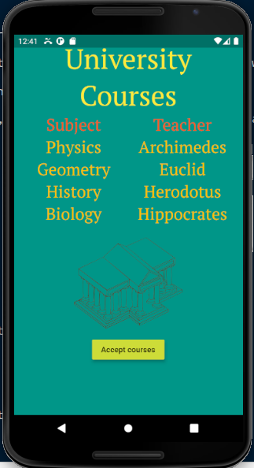
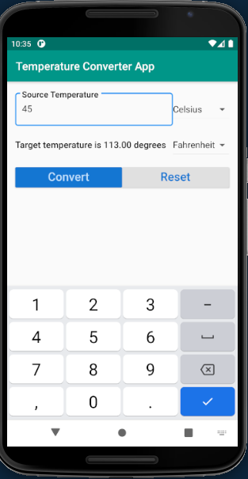

author: Draghici Marius-Robert
title: Flutter tutorial
summary: A step by step tutorial for creating Flutter applications.
id: flutter-tutorial
categories: web
environments: Flutter
status: draft
feedback link: https://github.com/robert-marius-draghici/my-codelabs/issues

# Flutter tutorial

## Part 1: Introduction to Flutter
Duration: 1

Flutter is a free and open-source, cross-platform development framework created by Google. 
It is used to develop high-performance, native mobile applications for iOS and Android from a single code base.
Apart from mobile platforms, it can also be used to develop applications for Windows, Mac, Linux, Google Fuchsia OS and the web.

## Why Flutter?
Duration: 2

There are three ways to develop applications for mobile:
- native means that we use the native, official tools such as Android Studio with Java and Kotlin for Android or Xcode with Swift and Objective-C for iOS. Even though we can build fast and reliable apps with these tools, the disadvantage is that we need to write the application for each platform.
- hybrid (such as Xamarin, Ionic, React Native) provides a bridge between the code and the mobile operating system so that the same code can be used on any mobile platform. However, this can cause performance and integration issues.
- web means that the application is written in HTML, CSS, Javascript and can be accessed through a browser. We only need one codebase for any system. The disadvantage is that the application cannot access the more advanced features of the device and the application is just a website in the form of an app.

### How does Flutter overcome this issues?
Flutter falls in the hybrid category and was developed by Google with features that overcome the current issues with hybrid apps:
- Flutter compiles to native for excellent performance. It supports Just in Time Compilation (code is recompiled in real time allowing for hot reload) and Ahead of Time Compilation (code is compiled to native ARM code for great performance on any device).
- Fast development.
- Great user experience.
- Single code base for multiple platforms (Android, iOS, web, Windows etc).
- It does not have bridges between the code and the device.

## The Dart language
Duration: 1

Flutter applications are written in Dart which is a programming language developed by Google. Dart is an object-oriented language that supports both ahead-of-time and just-in-time compilation. The Dart language offers many of the features seen in other languages including garbage collection, async-await, strong typing, generics, as well as a rich standard library.

## Part 2: Create a Hello World project in Flutter.
Duration: 5

Follow the instructions from [here](https://flutter.dev/docs/get-started/test-drive?tab=androidstudio#androidstudio) in order to create a new application, which will be named hello_flutter.

Remove the widget_test.dart file as it will not be required for the moment.
Remove the starting code from main.dart and replace with the following:

```dart
import 'package:flutter/material.dart'; // #1

void main() { // #2
  runApp( // #3
    Center( // #4
      child: Text( // #5
        "Hello, Flutter!",
        textDirection: TextDirection.ltr // #6
      ),
    )
  );
}
```

1. This package contains widgets that implement Material design, a design language developed by Google. A package is simply a library of functions.
2. The main method is the entry point of a Flutter app.
3. The runApp method inflates a widget and attaches it to the screen. In other words, it will show on the screen the widget passed to this method.
4. Everything in Flutter is a widget so Center and Text are widgets. The new keyword is not needed anymore in later versions of Flutter. Center is a container widget that centers its content onto the screen both horizontally and vertically.
5. The child property allows us to nest widgets inside other widgets. Text is just a text box.
6. The Text widget requires that a text direction is specified.

## Enhance the design of the Flutter App.
Duration: 7

In order to enhance the design of the application, we can use a MaterialApp widget to wrap the other widgets. The MaterialApp widget is an application that uses material design and wraps a number of widgets that are commonly required for material design applications. The MaterialApp allows us to customize our application with its properties.

Modify the code as follows:

```dart
import 'package:flutter/material.dart';

void main() {
  runApp(MaterialApp( // #1
      title: "Hello Flutter App", // #2 
      home: Material( // #3
        color: Colors.teal, #4
        child: Center( #5
          child: Text(
            "Hello, Flutter!",
            textDirection: TextDirection.ltr, 
            style: TextStyle(color: Colors.white, fontSize: 36.0), #6
          ),
        ),
      )));
}
```

1. The MaterialApp widget is usually the container of the other widgets in our application. It allows us to customize our application by adding a title, background color and others. It can also be useful for navigation and routing.
2. The title of the application. This is the title that the operating system will see.
3. The home property is the widget for the default route of the app. This is the route that is displayed first when the application is started normally, unless initialRoute is specified.
4. The Material class allows us to specify the color of its content (the background color in our example). Other properties are: shape, shadow, elevation and other properties that change the way it behaves.
5. Previously the Center widget was passed directly to the runApp method. However, in Flutter widgets can be nested using the child property.
6. Specify some style properties for the text. The fontSize requires a double. 

### Adding an application bar

The next step is to add an application bar. This is done by using the Scaffold widget. The Scaffold class implements the basic material design visual layout structure. It provides APIs for showing drawers, snack bars and bottom sheets among others.

Modify the code to look like this:
```dart
import 'package:flutter/material.dart';

void main() {
  runApp(MaterialApp(
      title: "Hello Flutter App", 
      home: Scaffold( // #1
          appBar: AppBar(title: Text("Title in App Bar")), // #2
          body: Material( // #3
            color: Colors.teal,
            child: Center(
              child: Text(
                "Hello, Flutter!",
                textDirection: TextDirection.ltr, 
                style: TextStyle(color: Colors.white, fontSize: 36.0),
              ),
            ),
          ))));
}
```

1. The Scaffold allows us to customize the layout of the application. 
2. The application bar.
3. The body represents the main content of the screen.

## Code organization for a Flutter application.
Duration: 10

Even though we can write the entire application code in the runApp method, this is not recommended especially if the application grows over time. In general, the main method should be as simple as possible.

The Flutter framework is written in the Dart programming language, which is an object-oriented language. This means that a widget is nothing more than an object, an instance of a class. Although the Flutter framework provides many widgets, we can also create our own. 

In order to simplify the main method, we will create a new class called HelloFlutterApp and move the application code in this class. The HelloFlutterApp class will extend the StatelessWidget abstract class, which is a generic widget that does not have any state. Then, the HelloFlutterApp class needs to override the build method of the superclass. We move the MaterialApp widget from main to the build method and in the runApp method we return a new instance of HelloFlutterApp. Also, we can further simplify the main method by using the arrow notation.

The code should look like this:
```dart
import 'package:flutter/material.dart';

void main() => runApp(new HelloFlutterApp()); // #1

class HelloFlutterApp extends StatelessWidget { // #2
  @override
  Widget build(BuildContext context) { // #3
    return MaterialApp(
        title: "Hello Flutter App",
        home: Scaffold(
            appBar: AppBar(title: Text("Title in App Bar")),
            body: Material(
              color: Colors.teal,
              child: Center(
                child: Text(
                  "Hello, Flutter!",
                  textDirection: TextDirection.ltr,
                  style: TextStyle(color: Colors.white, fontSize: 36.0),
                ),
              ),
            )));
  }
}
```

1. The main method now has only one line using the arrow notation. The application code was moved from the runApp method in the build method of HelloFlutterApp.
2. The class holding the definition of our application.
3. The build method inherited from StatelessWidget needs to be implemented, because it is an abstract method.

To further modularize the code, we can create a file for each class and files could be structured in packages such as screens, pages etc. For our application, we want to have the home screen (the material widget in the home property)in a separate file. 

Create a new folder called screens in the lib directory. Then create a file home.dart and a class Home and move the code from the body property in the build method of the Home class.

The home.dart file should look like this:
```dart
import 'package:flutter/material.dart';

class Home extends StatelessWidget {
  @override
  Widget build(BuildContext context) {
    return Material(
      color: Colors.teal,
      child: Center(
        child: Text(
          "Hello, Flutter!",
          textDirection: TextDirection.ltr,
          style: TextStyle(color: Colors.white, fontSize: 36.0),
        ),
      ),
    );
  }
}
```

The main class will look like this:
```dart
import 'package:flutter/material.dart';

import 'screens/home.dart'; // #1

void main() => runApp(new HelloFlutterApp());

class HelloFlutterApp extends StatelessWidget {
  @override
  Widget build(BuildContext context) {
    return MaterialApp(
        debugShowCheckedModeBanner: false, // #2
        title: "Hello Flutter App",
        home: Scaffold(
            appBar: AppBar(title: Text("Title in App Bar")), body: Home())); // #3
  }
}
```

1. Import the contents of the home.dart file.
2. debugShowCheckedModeBanner will remove the debug banner that appears in the top right corner of the app.
3. Replace the code from the body property with the class.

## Adding logic to a Flutter application.
Duration: 7

Since Widgets are instances of a class, we can add our own methods to a class to perform the business logic.

For our application, we want to customize the text shown in the Home screen. For this, we create a new method in the Home class called sayHello which returns a String.

Dart is a strongly typed language meaning that if we declare a variable of type String (String hello; for instance) then we cannot change its type later in the code. However, if we declare hello using var (var hello;) then hello can hold any type. It is recommended to specify the specific type for a variable and not use var. Numbers can be of type int, double and num (num can be either an int or a double).

Now we want our application to show a different text to the user based on the time of the day:
- before 12: "Good morning!"
- between 12-18: "Good afternoon!"
- after 18: "Good evening!"
Also, we want to show the current time.

The home.dart file should look like this:
```dart
import 'package:flutter/material.dart';

class Home extends StatelessWidget {
  @override
  Widget build(BuildContext context) {
    return Material(
      color: Colors.teal,
      child: Center(
        child: Text(
          sayHello(), // #1
          textDirection: TextDirection.ltr,
          style: TextStyle(color: Colors.white, fontSize: 36.0),
        ),
      ),
    );
  }

  String sayHello() {
    String hello;
    DateTime now = DateTime.now();
    int hour = now.hour;
    int minute = now.minute;
    String minutes = (minute < 10) ? "0" + minute.toString() : minute.toString(); // #2

    if (hour < 12) {
      hello = "Good morning!";
    } else if (hour < 18) {
      hello = "Good afternoon!";
    } else {
      hello = "Good evening!";
    }

    return "It's now " + hour.toString() + ":" + minutes + ".\n" + hello;
  }
}
```

1. Replace the hard-coded String with the one returned by the sayHello method.
2. We want the minutes to be shown in two digits.

## Part 3: The Basic Widgets of Flutter
Duration: 1

Flutter provides a set of basic Widgets that can be used along with Scaffold and AppBar in order to develop applications. This basic Widgets include:
- Container
- Text
- Row and Column
- Image
- RaisedButton
- AlertDialog
- Box Constraints

## Container
Duration: 5

Container is a widget class that allows you to customize its child widget through its properties. It can be seen as the equivalent of the div class from html. The Container widget allows us to specify properties such as:
- alignment = aligns the child widget within the container.
- color = the background color of the container.
- constraints = additional constraints to apply to the child widget.
- clipBehaviour = describes the clip behaviour when Container.decoration is not null.
- decoration = the decoration to paint behind the child widget.
- foregroundDecoration = the decoration to paint in front of the child widget.
- height and width = specifies the container size and is affected by box constraints. If we view the widget as a box, then the box constraints are the minimum and maximum width and height of the widget. Some widgets impose their constraints on their child widgets, which means that the child's width and height parameters are ignored, while other widgets (such as Center) loosen their constraints so that the maximum is preserved but the minimum is ignored.
- margin = the distance between a widget and the other widgets on the screen.
- padding = the distance between the content of a widget and its borders.11

Both margin and padding use the EdgeInsets.All(10.0) constructor which creates a margin or padding on all 4 sides of a box.

Container widget example:
```dart
Container(
  alignment: Alignment.center,
  color: Colors.teal,
  width: 192.0,
  height: 96.0,
  child: Text("This is a container widget", textDirection: TextDirection.ltr,)
)
```

More details about the Container widget can be found [here](https://api.flutter.dev/flutter/widgets/Container-class.html) .

More details about box constraints can be found [here](https://flutter.dev/docs/development/ui/layout/box-constraints) .

## Text
Duration: 5

The Text widget displays a string of text with a single style. The string can be single line or multiline. The Text widget provides properties such as:
- data = the string of text to be displayed.
- textDirection = the directionality of the text such as left-to-right or right-to-left.
- style = a TextStyle object which describes how to format and paint text. It has properties such as fontSize, decoration, fontFamily and weight.

Text widget example:
```dart
Text(
  "This is a text widget.",
  textDirection: TextDirection.ltr,
  style: TextStyle(
	  fontSize: 50,
	  decoration: TextDecoration.none,
	  fontFamily: 'Schyler',
	  fontWeight: FontWeight.normal),
)
```

If we want to use a custom font, we have to:
1. import the font files. Font files can be downloaded from https://fonts.google.com/ and the .ttf files must be added in the fonts folder.
2. declare the font in the pubspec.yaml file. The pubspec.yaml file contains information about project metadata and dependencies.
	Example of font definition:

```
    fonts:
        - family: Oswald
            fonts:
                - asset: fonts/Oswald-Regular.ttf
                - asset: fonts/Oswald-Medium.ttf
                  style: italic
                - asset: fonts/Oswald-Light.ttf
                  weight: 300
                - asset: fonts/Oswald-ExtraLight.ttf
                  weight: 100
                - asset: fonts/Oswald-SemiBold.ttf
                  weight: 600
                - asset: fonts/Oswald-Bold.ttf
                  weight: 800
```

3. use the font in the widget.

More details about the Text widget can be found [here](https://api.flutter.dev/flutter/widgets/Text-class.html) .

## Row and Column
Duration: 3

The Row and Column widgets allow us to better group the widgets in an application. The Row widget is a list of child widgets placed horizontally, while the Column widget is a list of child widgets placed vertically. Since these widgets contain an array of widgets, they have a children property instead of a child property.

Row widget example:
```dart
Row(
  children: [
	Text(
	  "This is the first row.",
	  textDirection: TextDirection.ltr,
	),
	Expanded( // #1
		child: Text(
	  "This is the second row.",
	  textDirection: TextDirection.ltr,
	)),
  ],
)
```

1. If there are more children in a Row that will not fit in the available room, we can wrap the children widgets in an Expanded widget which will expand the content of the widget in order to fit the available space.

Column widget example:
```dart
Column(
  children: [
	Row(children: [...]),
	Row(children: [...]),
  ],
)
```

More details about the Row widget can be found [here](https://api.flutter.dev/flutter/widgets/Row-class.html) .

More details about the Column widget can be found [here](https://api.flutter.dev/flutter/widgets/Column-class.html) .

## Image
Duration: 3

The Image widget is used to display an image. 
The image can come from the following sources:
- a file
- assets which are resources that we add to the project
- the network from an URL
- ImageProvider class 
- the memory where it is stored as an Uint8List.

Flutter accepts images in many formats, however it does not support .svg files yet.
Images can be downloaded from [https://openclipart.org/](https://openclipart.org/) .
To import the images we need to uncomment the assets section from the pubspec.yaml file and add the path to the image:

```
  assets:
   - images/image.png
```

To use an image imported from the assets, we define an AssetImage object and we pass this object to the Image constructor:

```dart
AssetImage imageAsset = AssetImage('images/image.png');
Image image = Image(image: imageAsset, width: 400.0, height: 400.0);
```

More details about the Image widget can be found [here](https://api.flutter.dev/flutter/widgets/Image-class.html) .

## RaisedButton and AlertDialog
Duration: 3

A raised button is based on a Material widget whose Material.elevation increases when the button is pressed. RaisedButton adds dimension to otherwise mostly flat layouts, such as a long lists of content or wide empty spaces.

RaisedButton widget example:
```dart
RaisedButton(
  child: Text("Raised button"),
  color: Colors.deepPurple,
  elevation: 5.0,
  onPressed: () { // #1
	callback(context);
  },
)
```

1. A RaisedButton needs the onPressed property which is an anonymous method that performs an action when the button is pressed. If this property is not set, the button will be flat and greyed out.

In the callback method we can use an alert dialog to give feedback to the user. An AlertDialog informs the user about situations that require acknowledgement. An alert dialog has an optional title and an optional list of actions. The title is displayed above the content and the actions are displayed below the content.

AlertDialog widget example:
```dart
var alert = AlertDialog(
	title: Text("AlertDialog Title"),
	content: Text("AlertDialog Content"), 
);
showDialog(
	context: context,
	builder: (BuilderContext) => alert
);
```

More details about the RaisedButton widget can be found [here](https://api.flutter.dev/flutter/material/RaisedButton-class.html) .

More details about the AlertDialog widget can be found [here](https://api.flutter.dev/flutter/material/AlertDialog-class.html) .

## Practical application for Part 3: University Courses app
Duration: 15

Now we will develop a small application to put in practice all the widgets presented during this part. The application will have one screen which shows some university courses along with their teachers, an image and a raised button to accept the courses presented on the screen.

We begin with the main method in main.dart.

```dart
import 'package:course_management/home.dart';
import 'package:flutter/material.dart'; // #1

void main() => runApp(MyApp()); // #2

class MyApp extends StatelessWidget { 
  @override
  Widget build(BuildContext context) {
    return MaterialApp( // #3
      title: 'University Courses',
      home: Home(), // #4
      debugShowCheckedModeBanner: false,
    );
  }
}
```

1. Import the required packages.
2. We want the main function to be as concise as possible so we write the application code in the MyApp class.
3. The application uses material design.
4. The content for the home screen is in another class, so our code will be more modular.

After writing the main class, we create the home.dart file where we will write the code for the home screen.

```dart
import 'package:flutter/material.dart'; 

class Home extends StatelessWidget {
  @override
  Widget build(BuildContext context) {
    return Container( // #1
      child: Column( // #2
        children: <Widget>[
          text("University Courses", Colors.yellow, 'PTSerif', 50.0, // #3
              FontWeight.w400),
          Row(
            children: <Widget>[
              Expanded(
                  child: text("Subject", Colors.deepOrange, 'PTSerif', 30.0,
                      FontWeight.w500)),
              Expanded(
                  child: text("Teacher", Colors.deepOrange, 'PTSerif', 30.0,
                      FontWeight.w500)),
            ],
          ),
          Row(children: <Widget>[
            Expanded(
                child: text(
                    "Physics", Colors.amber, 'PTSerif', 30.0, FontWeight.w300)),
            Expanded(
                child: text("Archimedes", Colors.amber, 'PTSerif', 30.0,
                    FontWeight.w300)),
          ]),
          Row(children: <Widget>[
            Expanded(
                child: text("Geometry", Colors.amber, 'PTSerif', 30.0,
                    FontWeight.w300)),
            Expanded(
                child: text(
                    "Euclid", Colors.amber, 'PTSerif', 30.0, FontWeight.w300)),
          ]),
          Row(children: <Widget>[
            Expanded(
                child: text(
                    "History", Colors.amber, 'PTSerif', 30.0, FontWeight.w300)),
            Expanded(
                child: text("Herodotus", Colors.amber, 'PTSerif', 30.0,
                    FontWeight.w300)),
          ]),
          Row(children: <Widget>[
            Expanded(
                child: text(
                    "Biology", Colors.amber, 'PTSerif', 30.0, FontWeight.w300)),
            Expanded(
                child: text("Hippocrates", Colors.amber, 'PTSerif', 30.0,
                    FontWeight.w300)),
          ]),
          Row(
            children: <Widget>[
              Image(
                image: AssetImage('images/university.png'),
                width: 200.0,
                height: 200.0,
              )
            ],
            mainAxisAlignment: MainAxisAlignment.center,
          ),
          Row(
            children: <Widget>[
              RaisedButton(
                child: Text("Accept courses"),
                color: Colors.lime,
                elevation: 5.0,
                onPressed: () {
                  onPressed(context);
                },
              )
            ],
            mainAxisAlignment: MainAxisAlignment.center,
          ),
        ],
      ),
      color: Colors.teal,
      padding: EdgeInsets.all(10.0),
    );
  }

  Widget text(String data, MaterialColor color, String fontFamily,
      double fontSize, FontWeight fontWeight) {
    return Text(data,
        textAlign: TextAlign.center,
        style: TextStyle(
          decoration: TextDecoration.none,
          color: color,
          fontFamily: fontFamily,
          fontSize: fontSize,
          fontWeight: fontWeight,
        ));
  }

  void onPressed(BuildContext context) { // #4
    var alert = AlertDialog(
      title: Text("Accept courses"),
      content: Text("Courses accepted."),
    );
    showDialog(context: context, builder: (BuildContext) => alert);
  }
}
```

1. We wrap the widgets composing the screen in a Container widget.
2. We use rows and columns to group the different elements on the screen.
3. Since there are many text fields in this application, we moved the Text widget in a separate method with the required parameters in order to avoid duplicating code.
4. The onPressed function is called whenever the button is pressed.

Since we use a custom font and an image, we also need to update the assets and fonts sections of the pubspec.yml file.

```yml
  ...
  assets:
   - university.png
  ...
  fonts:
  - family: PTSerif
   fonts:
     - asset: fonts/PTSerif-Regular.ttf
     - asset: fonts/PTSerif-Italic.ttf
       style: italic
     - asset: fonts/PTSerif-Bold.ttf
       weight: 700
     - asset: fonts/PTSerif-BoldItalic.ttf
       style: italic
       weight: 700
  ...
```

The final application should look like this:




## Part 4: Interactivity in Flutter
Duration: 5

So far, the applications that we developed showed only static content using non-interactive and stateless widgets. However, more advanced applications should allow the user to input data and react to this input. For an application to be able to handle user input, it needs to maintain state. State represents the information that can be read synchronously when the widget is built (initialisation stage) and might change during the lifetime of the widget. 

In Flutter, it is not the widget that changes, but the State associated with it. Classes that inherit StatefulWidget are immutable, while the State class is mutable.

### Differences between StatelessWidget and StatefulWidget
|||
| ----------------------------------------------------------  | ------------------------------------------------------    |
|                       **StatelessWidget**                   |                     **StatefulWidget**                    |
|               Does not require a mutable state #1           |                    Has mutable state                      | 
|                 Overrides the build() method #2             | Overrides the createState() method and returns a State    | 
| Use when the UI depends on information in the object itself |         Use when the UI can change dynamically            |

1. In other words, a StatelessWidget cannot change its state during the runtime of the application, meaning that the widget cannot be redrawn while the app is running. On the other hand, a StatefulWidget can change its state multiple times within its lifetime and can be redrawn on to the screen any number of times while the app is running.

2. Extending StatelessWidget requires overriding the build() method where you define the UI of the application. However, when you extend a StatefulWidget you need to override the createState() method which returns the state. This means that the UI is not defined in the widget, but in the state. The state class is the one that implements the build method by extending the State class.

## How to use a StatefulWidget
Duration: 3

1. Create a class that extends the StatefulWidget class and implements the createState method which returns a state class.
2. Create the state class which contains the properties that will change during the lifetime of the widget. The state class extends the State<T> class, where T is the name of the widget class that extends StatefulWidget. Usually the name of the state class should start with _ in order to emphasize that it is private and should respect the template <name of the stateful widget> + "State".
3. Since the state class extends State, it must implement the build method which returns a Widget. This build method is the same as the one implemented by a stateless widget.
4. To make changes call the setState() method. Changes are usually made through events, which are treated as normal properties of a Widget. The event triggers every time the content of the widget changes.

```dart
class ClassWithState extends StatefulWidget { #1
    @override
    State<StatefulWidget> createState() => _ClassWithStateState(); #1
}

class _ClassWithStateState extends State<ClassWithState> { #2
    String state = "";
    
    @override
    Widget build(BuildContext context) { #3
        ...
        eventProperty: (String value) {
            setState(() {state = value;}); #4
        }
        ... 
    }
}
```

Examples of events include:
- onChanged which changes the widget as soon as a change is made;
- onSubmitted which sets the state only after the Enter button on the keyboard is pressed;

## DropdownButton and DropdownMenuItem
Duration: 5

DropdownButton is a material design button that lets the user select from a number of items. The button shows the currently selected item as well as an arrow that opens a menu for selecting another item.

DropdownButton is a generic class which means that a type T needs to be specified when using it. The type T is the type of the value that each dropdown item represents. All the entries in the dropdown menu have to be of the same type. The items in a dropdown menu are instances of DropdownMenuItem class.

The onChanged callback should update a state variable that defines the dropdown's value. It should also call State.setState to rebuild the dropdown with the new value.

A dropdown button should look like this:
```dart
DropdownButton<T>(
    items: <T>[item_1, item_2, ..., item_n].map((T value) { // #1
        return DropdownMenuItem<T>(
            value: value,
            child: <child widget>,
        );
    }).toList(), // #2
    value: <value of type T>, // #3
    onChanged: (T value) {
        setState(() {state = value;});
    },
)
```

1. The items property is an array with the possible values to choose from in the dropdown. Map is a method that iterates though all the values from the array and perform a function on each of them.
2. toList collects all the elements that are returned by map into a list.
3. The value property is the current selected value from the dropdown menu.

More details about the DropdownButton widget can be found [here](https://api.flutter.dev/flutter/material/DropdownButton-class.html) .

More details about the DropdownMenuItem widget can be found [here](https://api.flutter.dev/flutter/material/DropdownMenuItem-class.html) .

## Practical application for Part 4: Temperature Converter
Duration: 15

To practice with StatefulWidgets and DropdownButtons, we will build a Temperature Converter application.

We begin with the main method and the MyApp class:

```dart
import 'package:flutter/material.dart';

void main() => runApp(MyApp());

class MyApp extends StatelessWidget {
  @override
  Widget build(BuildContext context) {
    return MaterialApp(
      title: 'Temperature converter',
      theme: ThemeData(primarySwatch: Colors.blue,),
      home: TemperatureConverter(),
      debugShowCheckedModeBanner: false,
    );
  }
}
```

Next, we write the TemperatureConverter class which extends a StatefulWidget:

```dart
class TemperatureConverter extends StatefulWidget {
  @override
  State<StatefulWidget> createState() => _TemperatureConverterState();
}
```

Then, we write the state class where the UI is actually implemented.

The state of a widget is represented by the properties of the class that are mutable.

```dart
class _TemperatureConverterState extends State<TemperatureConverter> {
  final double _padding = 5.0;
  final _temperatureScales = ['Celsius', 'Fahrenheit', 'Kelvin'];
  TextEditingController sourceTemperatureController = TextEditingController();
  String result = '';
  String currentSourceScale = 'Celsius';
  String currentTargetScale = 'Fahrenheit';
```

Since _TemperatureConverterState extends State, it must implement the build method that returns the Widget representing the UI.

```dart
  @override
  Widget build(BuildContext context) {
    TextStyle textStyle = Theme.of(context).textTheme.headline6; // #1

    return Scaffold( // #2
      appBar: AppBar( // #3
        title: Text("Temperature Converter App"),
        backgroundColor: Colors.teal,
      ),
```

1. If we do not want to import a custom font for our textStyle property, then we can extract the textStyle from the theme of the context. The TextTheme class contains the definition of several text styles found in Material design. More details can be found [here](https://api.flutter.dev/flutter/material/TextTheme-class.html).
2. Scaffold is a widget that implements the layout of the application. It provides APIs for showing drawers, snack bars, and bottom sheets. More details can be found [here](https://api.flutter.dev/flutter/material/Scaffold-class.html).
3. The AppBar widget consists of a toolbar and potentially other widgets, usually placed at the top of the application. App bars are typically used in the Scaffold.appBar property, which places the app bar as a fixed-height widget at the top of the screen. More information can be found [here](https://api.flutter.dev/flutter/material/AppBar-class.html).

The body property of the Scaffold contains the primary content of the scaffold:

```dart
      body: Container(
        padding: EdgeInsets.all(15.0),
        child: Column(children: <Widget>[
            Padding( // #1
              padding: EdgeInsets.only(top: _padding, bottom: _padding),
              child: Row(
                children: <Widget>[
                  Expanded(
                    child: TextField( #2
                      controller: sourceTemperatureController, // #3
                      decoration: InputDecoration( // #4
                          hintText: "e.g. 30", // #5
                          labelText: "Source Temperature", // #6
                          labelStyle: textStyle, // #7
                          border: OutlineInputBorder( // #8
                              borderRadius: BorderRadius.circular(5.0))),
                      keyboardType: TextInputType.number, // #9
                    ),
                  ),
                  DropdownButton<String>(
                    items: _temperatureScales
                        .map((String value) => DropdownMenuItem(
                              value: value,
                              child: Text(value),
                            ))
                        .toList(),
                    value: currentSourceScale,
                    onChanged: (String value) {
                      setState(() {
                        this.currentSourceScale = value;
                      });
                    },
                  ),
                ],
              ),
            ),
```

1. The Padding widget insets its child by the given padding. More details can be found [here](https://api.flutter.dev/flutter/widgets/Padding-class.html).
2. The TextField widget lets the user enter text, either with hardware keyboard or with an onscreen keyboard. More details can be found [here](https://api.flutter.dev/flutter/material/TextField-class.html).
3. The TextEditingController class is a controller for an editable text field. Whenever the user modifies a text field with an associated TextEditingController, the text field updates value and the controller notifies its listeners. More details can be found [here](https://api.flutter.dev/flutter/widgets/TextEditingController-class.html). This class is a shortcut to creating a variable and updating it with the onChanged event.
4. InputDecoration is the decoration to show around the text field. More details can be found [here](https://api.flutter.dev/flutter/material/InputDecoration-class.html).
5. The hintText property suggests what sort of input the field accepts.
6. The labelText property describes the input field.
7. The labelStyle property is the style to use for the labelText when the label is above the input field.
8. The border property specifies the shape of the border to draw around the decoration's container.
9. Since the text field can only contain numbers (it is a temperature), we can use the property keyboardType to specify the type of keyboard to use for editing the text, in this case a keyboard with only numbers.

These widgets define the rest of the layout:

```dart
            Padding(
              padding: EdgeInsets.only(top: _padding, bottom: _padding),
              child: Row(
                children: <Widget>[
                  Expanded(
                    child: Text(
                      "Target temperature is " + result + " degrees",
                      style: TextStyle(
                          fontWeight: FontWeight.w500, fontSize: 16.0),
                    ),
                  ),
                  DropdownButton<String>(
                    items: _temperatureScales
                        .map((String value) => DropdownMenuItem(
                              value: value,
                              child: Text(value),
                            ))
                        .toList(),
                    value: this.currentTargetScale,
                    onChanged: (String value) {
                      setState(() {
                        this.currentTargetScale = value;
                      });
                    },
                  ),
                ],
              ),
            ),
            Padding(
              padding: EdgeInsets.only(top: _padding, bottom: _padding),
              child: Row(
                children: <Widget>[
                  Expanded(
                    child: RaisedButton(
                      color: Theme.of(context).primaryColorDark,
                      textColor: Theme.of(context).primaryColorLight,
                      onPressed: () {
                        setState(() {
                          result = _convert();
                        });
                      },
                      child: Text(
                        'Convert',
                        textScaleFactor: 1.5,
                      ),
                    ),
                  ),
                  Expanded(
                      child: RaisedButton(
                    color: Theme.of(context).buttonColor,
                    textColor: Theme.of(context).primaryColorDark,
                    onPressed: () {
                      setState(() {
                        _reset();
                      });
                    },
                    child: Text(
                      'Reset',
                      textScaleFactor: 1.5,
                    ),
                  )),
                ],
              ),
            ),
          ],
        ),
      ),
    );
  }
```

This methods implement the logic for converting a temperature and reseting the form by deleting the contents of the fields.
```dart
  String _convert() {
    double sourceTemperature = double.parse(sourceTemperatureController.text);
    double targetTemperature;
    if (currentSourceScale == "Celsius") {
      if (currentTargetScale == "Fahrenheit") {
        setState(() { targetTemperature = sourceTemperature * 1.8 + 32; });
      } else if (currentTargetScale == "Kelvin") {
        setState(() { targetTemperature = sourceTemperature + 273.15; });
      } else { setState(() { targetTemperature = sourceTemperature; }); }
    }

    if (currentSourceScale == "Fahrenheit") { 
      if (currentTargetScale == "Celsius") {
        setState(() { targetTemperature = (sourceTemperature - 32) / 1.8; });
      } else if (currentTargetScale == "Kelvin") {
        setState(() { targetTemperature = (sourceTemperature + 459.67) * 5 / 9; });
      } else { setState(() { targetTemperature = sourceTemperature; }); }
    }

    if (currentSourceScale == "Kelvin") {
      if (currentTargetScale == "Celsius") {
        setState(() { targetTemperature = sourceTemperature - 273.15; });
      } else if (currentTargetScale == "Fahrenheit") {
        setState(() { targetTemperature = sourceTemperature * 9 / 5 - 459.67; });
      } else { setState(() { targetTemperature = sourceTemperature; }); }
    }

    result = targetTemperature.toStringAsFixed(2);
    return result;
  }

  void _reset() {
    sourceTemperatureController.text = "";
    setState(() { result = ""; });
  }
}
```

The final application should look like this:



You can test that the application works properly by using this [online temperature converter](https://www.rapidtables.com/convert/temperature/index.html).

