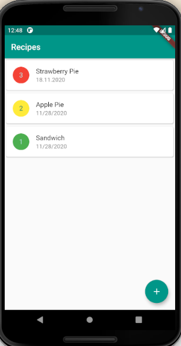
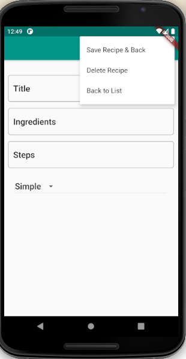
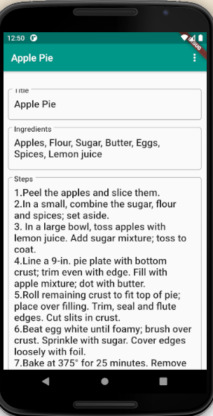
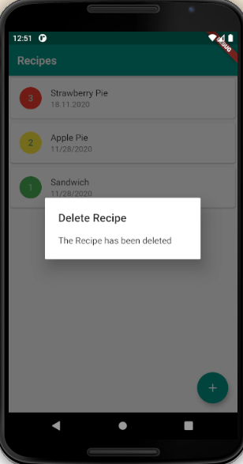
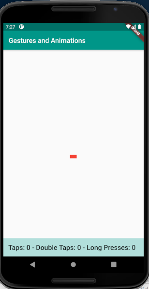
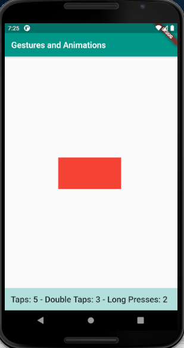

author: Draghici Marius-Robert
title: Flutter tutorial
summary: A step by step tutorial for creating Flutter applications.
id: flutter-tutorial
categories: web
environments: Flutter
status: draft
feedback link: https://github.com/robert-marius-draghici/my-codelabs/issues

# Flutter tutorial

## Part 1: Introduction to Flutter
Duration: 1

Flutter is a free and open-source, cross-platform development framework created by Google. 
It is used to develop high-performance, native mobile applications for iOS and Android from a single code base.
Apart from mobile platforms, it can also be used to develop applications for Windows, Mac, Linux, Google Fuchsia OS and the web.

## Why Flutter?
Duration: 2

There are three ways to develop applications for mobile:
- native means that we use the native, official tools such as Android Studio with Java and Kotlin for Android or Xcode with Swift and Objective-C for iOS. Even though we can build fast and reliable apps with these tools, the disadvantage is that we need to write the application for each platform.
- hybrid (such as Xamarin, Ionic, React Native) provides a bridge between the code and the mobile operating system so that the same code can be used on any mobile platform. However, this can cause performance and integration issues.
- web means that the application is written in HTML, CSS, Javascript and can be accessed through a browser. We only need one codebase for any system. The disadvantage is that the application cannot access the more advanced features of the device and the application is just a website in the form of an app.

### How does Flutter overcome this issues?
Flutter falls in the hybrid category and was developed by Google with features that overcome the current issues with hybrid apps:
- Flutter compiles to native for excellent performance. It supports Just in Time Compilation (code is recompiled in real time allowing for hot reload) and Ahead of Time Compilation (code is compiled to native ARM code for great performance on any device).
- Fast development.
- Great user experience.
- Single code base for multiple platforms (Android, iOS, web, Windows etc).
- It does not have bridges between the code and the device.

## The Dart language
Duration: 1

Flutter applications are written in Dart which is a programming language developed by Google. Dart is an object-oriented language that supports both ahead-of-time and just-in-time compilation. The Dart language offers many of the features seen in other languages including garbage collection, async-await, strong typing, generics, as well as a rich standard library.

## Part 2: Create a Hello World project in Flutter.
Duration: 5

Follow the instructions from [here](https://flutter.dev/docs/get-started/test-drive?tab=androidstudio#androidstudio) in order to create a new application, which will be named hello_flutter.

Remove the widget_test.dart file as it will not be required for the moment.
Remove the starting code from main.dart and replace with the following:

```dart
import 'package:flutter/material.dart'; // #1

void main() { // #2
  runApp( // #3
    Center( // #4
      child: Text( // #5
        "Hello, Flutter!",
        textDirection: TextDirection.ltr // #6
      ),
    )
  );
}
```

1. This package contains widgets that implement Material design, a design language developed by Google. A package is simply a library of functions.
2. The main method is the entry point of a Flutter app.
3. The runApp method inflates a widget and attaches it to the screen. In other words, it will show on the screen the widget passed to this method.
4. Everything in Flutter is a widget so Center and Text are widgets. The new keyword is not needed anymore in later versions of Flutter. Center is a container widget that centers its content onto the screen both horizontally and vertically.
5. The child property allows us to nest widgets inside other widgets. Text is just a text box.
6. The Text widget requires that a text direction is specified.

## Enhance the design of the Flutter App.
Duration: 7

In order to enhance the design of the application, we can use a MaterialApp widget to wrap the other widgets. The MaterialApp widget is an application that uses material design and wraps a number of widgets that are commonly required for material design applications. The MaterialApp allows us to customize our application with its properties.

Modify the code as follows:

```dart
import 'package:flutter/material.dart';

void main() {
  runApp(MaterialApp( // #1
      title: "Hello Flutter App", // #2 
      home: Material( // #3
        color: Colors.teal, #4
        child: Center( #5
          child: Text(
            "Hello, Flutter!",
            textDirection: TextDirection.ltr, 
            style: TextStyle(color: Colors.white, fontSize: 36.0), #6
          ),
        ),
      )));
}
```

1. The MaterialApp widget is usually the container of the other widgets in our application. It allows us to customize our application by adding a title, background color and others. It can also be useful for navigation and routing.
2. The title of the application. This is the title that the operating system will see.
3. The home property is the widget for the default route of the app. This is the route that is displayed first when the application is started normally, unless initialRoute is specified.
4. The Material class allows us to specify the color of its content (the background color in our example). Other properties are: shape, shadow, elevation and other properties that change the way it behaves.
5. Previously the Center widget was passed directly to the runApp method. However, in Flutter widgets can be nested using the child property.
6. Specify some style properties for the text. The fontSize requires a double. 

### Adding an application bar

The next step is to add an application bar. This is done by using the Scaffold widget. The Scaffold class implements the basic material design visual layout structure. It provides APIs for showing drawers, snack bars and bottom sheets among others.

Modify the code to look like this:
```dart
import 'package:flutter/material.dart';

void main() {
  runApp(MaterialApp(
      title: "Hello Flutter App", 
      home: Scaffold( // #1
          appBar: AppBar(title: Text("Title in App Bar")), // #2
          body: Material( // #3
            color: Colors.teal,
            child: Center(
              child: Text(
                "Hello, Flutter!",
                textDirection: TextDirection.ltr, 
                style: TextStyle(color: Colors.white, fontSize: 36.0),
              ),
            ),
          ))));
}
```

1. The Scaffold allows us to customize the layout of the application. 
2. The application bar.
3. The body represents the main content of the screen.

## Code organization for a Flutter application.
Duration: 10

Even though we can write the entire application code in the runApp method, this is not recommended especially if the application grows over time. In general, the main method should be as simple as possible.

The Flutter framework is written in the Dart programming language, which is an object-oriented language. This means that a widget is nothing more than an object, an instance of a class. Although the Flutter framework provides many widgets, we can also create our own. 

In order to simplify the main method, we will create a new class called HelloFlutterApp and move the application code in this class. The HelloFlutterApp class will extend the StatelessWidget abstract class, which is a generic widget that does not have any state. Then, the HelloFlutterApp class needs to override the build method of the superclass. We move the MaterialApp widget from main to the build method and in the runApp method we return a new instance of HelloFlutterApp. Also, we can further simplify the main method by using the arrow notation.

The code should look like this:
```dart
import 'package:flutter/material.dart';

void main() => runApp(new HelloFlutterApp()); // #1

class HelloFlutterApp extends StatelessWidget { // #2
  @override
  Widget build(BuildContext context) { // #3
    return MaterialApp(
        title: "Hello Flutter App",
        home: Scaffold(
            appBar: AppBar(title: Text("Title in App Bar")),
            body: Material(
              color: Colors.teal,
              child: Center(
                child: Text(
                  "Hello, Flutter!",
                  textDirection: TextDirection.ltr,
                  style: TextStyle(color: Colors.white, fontSize: 36.0),
                ),
              ),
            )));
  }
}
```

1. The main method now has only one line using the arrow notation. The application code was moved from the runApp method in the build method of HelloFlutterApp.
2. The class holding the definition of our application.
3. The build method inherited from StatelessWidget needs to be implemented, because it is an abstract method.

To further modularize the code, we can create a file for each class and files could be structured in packages such as screens, pages etc. For our application, we want to have the home screen (the material widget in the home property)in a separate file. 

Create a new folder called screens in the lib directory. Then create a file home.dart and a class Home and move the code from the body property in the build method of the Home class.

The home.dart file should look like this:
```dart
import 'package:flutter/material.dart';

class Home extends StatelessWidget {
  @override
  Widget build(BuildContext context) {
    return Material(
      color: Colors.teal,
      child: Center(
        child: Text(
          "Hello, Flutter!",
          textDirection: TextDirection.ltr,
          style: TextStyle(color: Colors.white, fontSize: 36.0),
        ),
      ),
    );
  }
}
```

The main class will look like this:
```dart
import 'package:flutter/material.dart';

import 'screens/home.dart'; // #1

void main() => runApp(new HelloFlutterApp());

class HelloFlutterApp extends StatelessWidget {
  @override
  Widget build(BuildContext context) {
    return MaterialApp(
        debugShowCheckedModeBanner: false, // #2
        title: "Hello Flutter App",
        home: Scaffold(
            appBar: AppBar(title: Text("Title in App Bar")), body: Home())); // #3
  }
}
```

1. Import the contents of the home.dart file.
2. debugShowCheckedModeBanner will remove the debug banner that appears in the top right corner of the app.
3. Replace the code from the body property with the class.

## Adding logic to a Flutter application.
Duration: 5

Since Widgets are instances of a class, we can add our own methods to a class to perform the business logic.

For our application, we want to customize the text shown in the Home screen. For this, we create a new method in the Home class called sayHello which returns a String.

Dart is a strongly typed language meaning that if we declare a variable of type String (String hello; for instance) then we cannot change its type later in the code. However, if we declare hello using var (var hello;) then hello can hold any type. It is recommended to specify the specific type for a variable and not use var. Numbers can be of type int, double and num (num can be either an int or a double).

Now we want our application to show a different text to the user based on the time of the day:
- before 12: "Good morning!"
- between 12-18: "Good afternoon!"
- after 18: "Good evening!"
Also, we want to show the current time.

The home.dart file should look like this:
```dart
import 'package:flutter/material.dart';

class Home extends StatelessWidget {
  @override
  Widget build(BuildContext context) {
    return Material(
      color: Colors.teal,
      child: Center(
        child: Text(
          sayHello(), // #1
          textDirection: TextDirection.ltr,
          style: TextStyle(color: Colors.white, fontSize: 36.0),
        ),
      ),
    );
  }

  String sayHello() {
    String hello;
    DateTime now = DateTime.now();
    int hour = now.hour;
    int minute = now.minute;
    String minutes = (minute < 10) ? "0" + minute.toString() : minute.toString(); // #2

    if (hour < 12) {
      hello = "Good morning!";
    } else if (hour < 18) {
      hello = "Good afternoon!";
    } else {
      hello = "Good evening!";
    }

    return "It's now " + hour.toString() + ":" + minutes + ".\n" + hello;
  }
}
```

1. Replace the hard-coded String with the one returned by the sayHello method.
2. We want the minutes to be shown in two digits.

## Part 3: The Basic Widgets of Flutter
Duration: 1

Flutter provides a set of basic Widgets that can be used along with Scaffold and AppBar in order to develop applications. This basic Widgets include:
- Container
- Text
- Row and Column
- Image
- RaisedButton
- AlertDialog
- Box Constraints

## Container
Duration: 5

Container is a widget class that allows you to customize its child widget through its properties. It can be seen as the equivalent of the div class from html. The Container widget allows us to specify properties such as:
- alignment = aligns the child widget within the container.
- color = the background color of the container.
- constraints = additional constraints to apply to the child widget.
- clipBehaviour = describes the clip behaviour when Container.decoration is not null.
- decoration = the decoration to paint behind the child widget.
- foregroundDecoration = the decoration to paint in front of the child widget.
- height and width = specifies the container size and is affected by box constraints. If we view the widget as a box, then the box constraints are the minimum and maximum width and height of the widget. Some widgets impose their constraints on their child widgets, which means that the child's width and height parameters are ignored, while other widgets (such as Center) loosen their constraints so that the maximum is preserved but the minimum is ignored.
- margin = the distance between a widget and the other widgets on the screen.
- padding = the distance between the content of a widget and its borders.11

Both margin and padding use the EdgeInsets.All(10.0) constructor which creates a margin or padding on all 4 sides of a box.

Container widget example:
```dart
Container(
  alignment: Alignment.center,
  color: Colors.teal,
  width: 192.0,
  height: 96.0,
  child: Text("This is a container widget", textDirection: TextDirection.ltr,)
)
```

More details about the Container widget can be found [here](https://api.flutter.dev/flutter/widgets/Container-class.html) .

More details about box constraints can be found [here](https://flutter.dev/docs/development/ui/layout/box-constraints) .

## Text
Duration: 5

The Text widget displays a string of text with a single style. The string can be single line or multiline. The Text widget provides properties such as:
- data = the string of text to be displayed.
- textDirection = the directionality of the text such as left-to-right or right-to-left.
- style = a TextStyle object which describes how to format and paint text. It has properties such as fontSize, decoration, fontFamily and weight.

Text widget example:
```dart
Text(
  "This is a text widget.",
  textDirection: TextDirection.ltr,
  style: TextStyle(
	  fontSize: 50,
	  decoration: TextDecoration.none,
	  fontFamily: 'Schyler',
	  fontWeight: FontWeight.normal),
)
```

If we want to use a custom font, we have to:
1. import the font files. Font files can be downloaded from https://fonts.google.com/ and the .ttf files must be added in the fonts folder.
2. declare the font in the pubspec.yaml file. The pubspec.yaml file contains information about project metadata and dependencies.
	Example of font definition:

```
    fonts:
        - family: Oswald
            fonts:
                - asset: fonts/Oswald-Regular.ttf
                - asset: fonts/Oswald-Medium.ttf
                  style: italic
                - asset: fonts/Oswald-Light.ttf
                  weight: 300
                - asset: fonts/Oswald-ExtraLight.ttf
                  weight: 100
                - asset: fonts/Oswald-SemiBold.ttf
                  weight: 600
                - asset: fonts/Oswald-Bold.ttf
                  weight: 800
```

3. use the font in the widget.

More details about the Text widget can be found [here](https://api.flutter.dev/flutter/widgets/Text-class.html) .

## Row and Column
Duration: 3

The Row and Column widgets allow us to better group the widgets in an application. The Row widget is a list of child widgets placed horizontally, while the Column widget is a list of child widgets placed vertically. Since these widgets contain an array of widgets, they have a children property instead of a child property.

Row widget example:
```dart
Row(
  children: [
	Text(
	  "This is the first row.",
	  textDirection: TextDirection.ltr,
	),
	Expanded( // #1
		child: Text(
	  "This is the second row.",
	  textDirection: TextDirection.ltr,
	)),
  ],
)
```

1. If there are more children in a Row that will not fit in the available room, we can wrap the children widgets in an Expanded widget which will expand the content of the widget in order to fit the available space.

Column widget example:
```dart
Column(
  children: [
	Row(children: [...]),
	Row(children: [...]),
  ],
)
```

More details about the Row widget can be found [here](https://api.flutter.dev/flutter/widgets/Row-class.html) .

More details about the Column widget can be found [here](https://api.flutter.dev/flutter/widgets/Column-class.html) .

## Image
Duration: 3

The Image widget is used to display an image. 
The image can come from the following sources:
- a file
- assets which are resources that we add to the project
- the network from an URL
- ImageProvider class 
- the memory where it is stored as an Uint8List.

Flutter accepts images in many formats, however it does not support .svg files yet.
Images can be downloaded from [https://openclipart.org/](https://openclipart.org/) .
To import the images we need to uncomment the assets section from the pubspec.yaml file and add the path to the image:

```
  assets:
   - images/image.png
```

To use an image imported from the assets, we define an AssetImage object and we pass this object to the Image constructor:

```dart
AssetImage imageAsset = AssetImage('images/image.png');
Image image = Image(image: imageAsset, width: 400.0, height: 400.0);
```

More details about the Image widget can be found [here](https://api.flutter.dev/flutter/widgets/Image-class.html) .

## RaisedButton and AlertDialog
Duration: 3

A raised button is based on a Material widget whose Material.elevation increases when the button is pressed. RaisedButton adds dimension to otherwise mostly flat layouts, such as a long lists of content or wide empty spaces.

RaisedButton widget example:
```dart
RaisedButton(
  child: Text("Raised button"),
  color: Colors.deepPurple,
  elevation: 5.0,
  onPressed: () { // #1
	callback(context);
  },
)
```

1. A RaisedButton needs the onPressed property which is an anonymous method that performs an action when the button is pressed. If this property is not set, the button will be flat and greyed out.

In the callback method we can use an alert dialog to give feedback to the user. An AlertDialog informs the user about situations that require acknowledgement. An alert dialog has an optional title and an optional list of actions. The title is displayed above the content and the actions are displayed below the content.

AlertDialog widget example:
```dart
var alert = AlertDialog(
	title: Text("AlertDialog Title"),
	content: Text("AlertDialog Content"), 
);
showDialog(
	context: context,
	builder: (BuilderContext) => alert
);
```

More details about the RaisedButton widget can be found [here](https://api.flutter.dev/flutter/material/RaisedButton-class.html) .

More details about the AlertDialog widget can be found [here](https://api.flutter.dev/flutter/material/AlertDialog-class.html) .

## Practical application for Part 3: University Courses app
Duration: 15

Now we will develop a small application to put in practice all the widgets presented during this part. The application will have one screen which shows some university courses along with their teachers, an image and a raised button to accept the courses presented on the screen.

We begin with the main method in main.dart.

```dart
import 'package:course_management/home.dart';
import 'package:flutter/material.dart'; // #1

void main() => runApp(MyApp()); // #2

class MyApp extends StatelessWidget { 
  @override
  Widget build(BuildContext context) {
    return MaterialApp( // #3
      title: 'University Courses',
      home: Home(), // #4
      debugShowCheckedModeBanner: false,
    );
  }
}
```

1. Import the required packages.
2. We want the main function to be as concise as possible so we write the application code in the MyApp class.
3. The application uses material design.
4. The content for the home screen is in another class, so our code will be more modular.

After writing the main class, we create the home.dart file where we will write the code for the home screen.

```dart
import 'package:flutter/material.dart'; 

class Home extends StatelessWidget {
  @override
  Widget build(BuildContext context) {
    return Container( // #1
      child: Column( // #2
        children: <Widget>[
          text("University Courses", Colors.yellow, 'PTSerif', 50.0, // #3
              FontWeight.w400),
          Row(
            children: <Widget>[
              Expanded(
                  child: text("Subject", Colors.deepOrange, 'PTSerif', 30.0,
                      FontWeight.w500)),
              Expanded(
                  child: text("Teacher", Colors.deepOrange, 'PTSerif', 30.0,
                      FontWeight.w500)),
            ],
          ),
          Row(children: <Widget>[
            Expanded(
                child: text(
                    "Physics", Colors.amber, 'PTSerif', 30.0, FontWeight.w300)),
            Expanded(
                child: text("Archimedes", Colors.amber, 'PTSerif', 30.0,
                    FontWeight.w300)),
          ]),
          Row(children: <Widget>[
            Expanded(
                child: text("Geometry", Colors.amber, 'PTSerif', 30.0,
                    FontWeight.w300)),
            Expanded(
                child: text(
                    "Euclid", Colors.amber, 'PTSerif', 30.0, FontWeight.w300)),
          ]),
          Row(children: <Widget>[
            Expanded(
                child: text(
                    "History", Colors.amber, 'PTSerif', 30.0, FontWeight.w300)),
            Expanded(
                child: text("Herodotus", Colors.amber, 'PTSerif', 30.0,
                    FontWeight.w300)),
          ]),
          Row(children: <Widget>[
            Expanded(
                child: text(
                    "Biology", Colors.amber, 'PTSerif', 30.0, FontWeight.w300)),
            Expanded(
                child: text("Hippocrates", Colors.amber, 'PTSerif', 30.0,
                    FontWeight.w300)),
          ]),
          Row(
            children: <Widget>[
              Image(
                image: AssetImage('images/university.png'),
                width: 200.0,
                height: 200.0,
              )
            ],
            mainAxisAlignment: MainAxisAlignment.center,
          ),
          Row(
            children: <Widget>[
              RaisedButton(
                child: Text("Accept courses"),
                color: Colors.lime,
                elevation: 5.0,
                onPressed: () {
                  onPressed(context);
                },
              )
            ],
            mainAxisAlignment: MainAxisAlignment.center,
          ),
        ],
      ),
      color: Colors.teal,
      padding: EdgeInsets.all(10.0),
    );
  }

  Widget text(String data, MaterialColor color, String fontFamily,
      double fontSize, FontWeight fontWeight) {
    return Text(data,
        textAlign: TextAlign.center,
        style: TextStyle(
          decoration: TextDecoration.none,
          color: color,
          fontFamily: fontFamily,
          fontSize: fontSize,
          fontWeight: fontWeight,
        ));
  }

  void onPressed(BuildContext context) { // #4
    var alert = AlertDialog(
      title: Text("Accept courses"),
      content: Text("Courses accepted."),
    );
    showDialog(context: context, builder: (BuildContext) => alert);
  }
}
```

1. We wrap the widgets composing the screen in a Container widget.
2. We use rows and columns to group the different elements on the screen.
3. Since there are many text fields in this application, we moved the Text widget in a separate method with the required parameters in order to avoid duplicating code.
4. The onPressed function is called whenever the button is pressed.

Since we use a custom font and an image, we also need to update the assets and fonts sections of the pubspec.yml file.

```yml
  ...
  assets:
   - university.png
  ...
  fonts:
  - family: PTSerif
   fonts:
     - asset: fonts/PTSerif-Regular.ttf
     - asset: fonts/PTSerif-Italic.ttf
       style: italic
     - asset: fonts/PTSerif-Bold.ttf
       weight: 700
     - asset: fonts/PTSerif-BoldItalic.ttf
       style: italic
       weight: 700
  ...
```

The final application should look like this:


The code for this application can be found [here](https://github.com/Robert-Marius-Draghici/android-apps/tree/main/flutter/course_management).

## Part 4: Interactivity in Flutter
Duration: 5

So far, the applications that we developed showed only static content using non-interactive and stateless widgets. However, more advanced applications should allow the user to input data and react to this input. For an application to be able to handle user input, it needs to maintain state. State represents the information that can be read synchronously when the widget is built (initialisation stage) and might change during the lifetime of the widget. 

In Flutter, it is not the widget that changes, but the State associated with it. Classes that inherit StatefulWidget are immutable, while the State class is mutable.

### Differences between StatelessWidget and StatefulWidget
|||
| ----------------------------------------------------------  | ------------------------------------------------------    |
|                       **StatelessWidget**                   |                     **StatefulWidget**                    |
|               Does not require a mutable state #1           |                    Has mutable state                      | 
|                 Overrides the build() method #2             | Overrides the createState() method and returns a State    | 
| Use when the UI depends on information in the object itself |         Use when the UI can change dynamically            |

1. In other words, a StatelessWidget cannot change its state during the runtime of the application, meaning that the widget cannot be redrawn while the app is running. On the other hand, a StatefulWidget can change its state multiple times within its lifetime and can be redrawn on to the screen any number of times while the app is running.

2. Extending StatelessWidget requires overriding the build() method where you define the UI of the application. However, when you extend a StatefulWidget you need to override the createState() method which returns the state. This means that the UI is not defined in the widget, but in the state. The state class is the one that implements the build method by extending the State class.

## How to use a StatefulWidget
Duration: 3

1. Create a class that extends the StatefulWidget class and implements the createState method which returns a state class.
2. Create the state class which contains the properties that will change during the lifetime of the widget. The state class extends the State<T> class, where T is the name of the widget class that extends StatefulWidget. Usually the name of the state class should start with _ in order to emphasize that it is private and should respect the template <name of the stateful widget> + "State".
3. Since the state class extends State, it must implement the build method which returns a Widget. This build method is the same as the one implemented by a stateless widget.
4. To make changes call the setState() method. Changes are usually made through events, which are treated as normal properties of a Widget. The event triggers every time the content of the widget changes.

```dart
class ClassWithState extends StatefulWidget { #1
    @override
    State<StatefulWidget> createState() => _ClassWithStateState(); #1
}

class _ClassWithStateState extends State<ClassWithState> { #2
    String state = "";
    
    @override
    Widget build(BuildContext context) { #3
        ...
        eventProperty: (String value) {
            setState(() {state = value;}); #4
        }
        ... 
    }
}
```

Examples of events include:
- onChanged which changes the widget as soon as a change is made;
- onSubmitted which sets the state only after the Enter button on the keyboard is pressed;

## DropdownButton and DropdownMenuItem
Duration: 5

DropdownButton is a material design button that lets the user select from a number of items. The button shows the currently selected item as well as an arrow that opens a menu for selecting another item.

DropdownButton is a generic class which means that a type T needs to be specified when using it. The type T is the type of the value that each dropdown item represents. All the entries in the dropdown menu have to be of the same type. The items in a dropdown menu are instances of DropdownMenuItem class.

The onChanged callback should update a state variable that defines the dropdown's value. It should also call State.setState to rebuild the dropdown with the new value.

A dropdown button should look like this:
```dart
DropdownButton<T>(
    items: <T>[item_1, item_2, ..., item_n].map((T value) { // #1
        return DropdownMenuItem<T>(
            value: value,
            child: <child widget>,
        );
    }).toList(), // #2
    value: <value of type T>, // #3
    onChanged: (T value) {
        setState(() {state = value;});
    },
)
```

1. The items property is an array with the possible values to choose from in the dropdown. Map is a method that iterates though all the values from the array and perform a function on each of them.
2. toList collects all the elements that are returned by map into a list.
3. The value property is the current selected value from the dropdown menu.

More details about the DropdownButton widget can be found [here](https://api.flutter.dev/flutter/material/DropdownButton-class.html) .

More details about the DropdownMenuItem widget can be found [here](https://api.flutter.dev/flutter/material/DropdownMenuItem-class.html) .

## Practical application for Part 4: Temperature Converter
Duration: 15

To practice with StatefulWidgets and DropdownButtons, we will build a Temperature Converter application.

We begin with the main method and the MyApp class:

```dart
import 'package:flutter/material.dart';

void main() => runApp(MyApp());

class MyApp extends StatelessWidget {
  @override
  Widget build(BuildContext context) {
    return MaterialApp(
      title: 'Temperature converter',
      theme: ThemeData(primarySwatch: Colors.blue,),
      home: TemperatureConverter(),
      debugShowCheckedModeBanner: false,
    );
  }
}
```

Next, we write the TemperatureConverter class which extends a StatefulWidget:

```dart
class TemperatureConverter extends StatefulWidget {
  @override
  State<StatefulWidget> createState() => _TemperatureConverterState();
}
```

Then, we write the state class where the UI is actually implemented.

The state of a widget is represented by the properties of the class that are mutable.

```dart
class _TemperatureConverterState extends State<TemperatureConverter> {
  final double _padding = 5.0;
  final _temperatureScales = ['Celsius', 'Fahrenheit', 'Kelvin'];
  TextEditingController sourceTemperatureController = TextEditingController();
  String result = '';
  String currentSourceScale = 'Celsius';
  String currentTargetScale = 'Fahrenheit';
```

Since _TemperatureConverterState extends State, it must implement the build method that returns the Widget representing the UI.

```dart
  @override
  Widget build(BuildContext context) {
    TextStyle textStyle = Theme.of(context).textTheme.headline6; // #1

    return Scaffold( // #2
      appBar: AppBar( // #3
        title: Text("Temperature Converter App"),
        backgroundColor: Colors.teal,
      ),
```

1. If we do not want to import a custom font for our textStyle property, then we can extract the textStyle from the theme of the context. The [TextTheme class](https://api.flutter.dev/flutter/material/TextTheme-class.html) contains the definition of several text styles found in Material design.
2. [Scaffold](https://api.flutter.dev/flutter/material/Scaffold-class.html) is a widget that implements the layout of the application. It provides APIs for showing drawers, snack bars, and bottom sheets.
3. The [AppBar](https://api.flutter.dev/flutter/material/AppBar-class.html) widget consists of a toolbar and potentially other widgets, usually placed at the top of the application. App bars are typically used in the Scaffold.appBar property, which places the app bar as a fixed-height widget at the top of the screen.

The body property of the Scaffold contains the primary content of the scaffold:

```dart
      body: Container(
        padding: EdgeInsets.all(15.0),
        child: Column(children: <Widget>[
            Padding( // #1
              padding: EdgeInsets.only(top: _padding, bottom: _padding),
              child: Row(
                children: <Widget>[
                  Expanded(
                    child: TextField( #2
                      controller: sourceTemperatureController, // #3
                      decoration: InputDecoration( // #4
                          hintText: "e.g. 30", // #5
                          labelText: "Source Temperature", // #6
                          labelStyle: textStyle, // #7
                          border: OutlineInputBorder( // #8
                              borderRadius: BorderRadius.circular(5.0))),
                      keyboardType: TextInputType.number, // #9
                    ),
                  ),
                  DropdownButton<String>(
                    items: _temperatureScales
                        .map((String value) => DropdownMenuItem(
                              value: value,
                              child: Text(value),
                            ))
                        .toList(),
                    value: currentSourceScale,
                    onChanged: (String value) {
                      setState(() {
                        this.currentSourceScale = value;
                      });
                    },
                  ),
                ],
              ),
            ),
```

1. The [Padding](https://api.flutter.dev/flutter/widgets/Padding-class.html) widget insets its child by the given padding.
2. The [TextField](https://api.flutter.dev/flutter/material/TextField-class.html) widget lets the user enter text, either with hardware keyboard or with an onscreen keyboard.
3. The [TextEditingController class](https://api.flutter.dev/flutter/widgets/TextEditingController-class.html) is a controller for an editable text field. Whenever the user modifies a text field with an associated TextEditingController, the text field updates value and the controller notifies its listeners. This class is a shortcut to creating a variable and updating it with the onChanged event.
4. [InputDecoration](https://api.flutter.dev/flutter/material/InputDecoration-class.html) is the decoration to show around the text field.
5. The hintText property suggests what sort of input the field accepts.
6. The labelText property describes the input field.
7. The labelStyle property is the style to use for the labelText when the label is above the input field.
8. The border property specifies the shape of the border to draw around the decoration's container.
9. Since the text field can only contain numbers (it is a temperature), we can use the property keyboardType to specify the type of keyboard to use for editing the text, in this case a keyboard with only numbers.

These widgets define the rest of the layout:

```dart
            Padding(
              padding: EdgeInsets.only(top: _padding, bottom: _padding),
              child: Row(
                children: <Widget>[
                  Expanded(
                    child: Text(
                      "Target temperature is " + result + " degrees",
                      style: TextStyle(
                          fontWeight: FontWeight.w500, fontSize: 16.0),
                    ),
                  ),
                  DropdownButton<String>(
                    items: _temperatureScales
                        .map((String value) => DropdownMenuItem(
                              value: value,
                              child: Text(value),
                            ))
                        .toList(),
                    value: this.currentTargetScale,
                    onChanged: (String value) {
                      setState(() {
                        this.currentTargetScale = value;
                      });
                    },
                  ),
                ],
              ),
            ),
            Padding(
              padding: EdgeInsets.only(top: _padding, bottom: _padding),
              child: Row(
                children: <Widget>[
                  Expanded(
                    child: RaisedButton(
                      color: Theme.of(context).primaryColorDark,
                      textColor: Theme.of(context).primaryColorLight,
                      onPressed: () {
                        setState(() {
                          result = _convert();
                        });
                      },
                      child: Text(
                        'Convert',
                        textScaleFactor: 1.5,
                      ),
                    ),
                  ),
                  Expanded(
                      child: RaisedButton(
                    color: Theme.of(context).buttonColor,
                    textColor: Theme.of(context).primaryColorDark,
                    onPressed: () {
                      setState(() {
                        _reset();
                      });
                    },
                    child: Text(
                      'Reset',
                      textScaleFactor: 1.5,
                    ),
                  )),
                ],
              ),
            ),
          ],
        ),
      ),
    );
  }
```

This methods implement the logic for converting a temperature and reseting the form by deleting the contents of the fields.
```dart
  String _convert() {
    double sourceTemperature = double.parse(sourceTemperatureController.text);
    double targetTemperature;
    if (currentSourceScale == "Celsius") {
      if (currentTargetScale == "Fahrenheit") {
        setState(() { targetTemperature = sourceTemperature * 1.8 + 32; });
      } else if (currentTargetScale == "Kelvin") {
        setState(() { targetTemperature = sourceTemperature + 273.15; });
      } else { setState(() { targetTemperature = sourceTemperature; }); }
    }

    if (currentSourceScale == "Fahrenheit") { 
      if (currentTargetScale == "Celsius") {
        setState(() { targetTemperature = (sourceTemperature - 32) / 1.8; });
      } else if (currentTargetScale == "Kelvin") {
        setState(() { targetTemperature = (sourceTemperature + 459.67) * 5 / 9; });
      } else { setState(() { targetTemperature = sourceTemperature; }); }
    }

    if (currentSourceScale == "Kelvin") {
      if (currentTargetScale == "Celsius") {
        setState(() { targetTemperature = sourceTemperature - 273.15; });
      } else if (currentTargetScale == "Fahrenheit") {
        setState(() { targetTemperature = sourceTemperature * 9 / 5 - 459.67; });
      } else { setState(() { targetTemperature = sourceTemperature; }); }
    }

    result = targetTemperature.toStringAsFixed(2);
    return result;
  }

  void _reset() {
    sourceTemperatureController.text = "";
    setState(() { result = ""; });
  }
}
```

The final application should look like this:


The code for this application can be found [here](https://github.com/Robert-Marius-Draghici/android-apps/tree/main/flutter/temperature_converter_app).

You can test that the application works properly by using this [online temperature converter](https://www.rapidtables.com/convert/temperature/index.html).

## Part 5: Develop a real world application in Flutter.
Duration: 1

The goal of this part is to develop a real world application in Flutter by combining most of the concepts learned in the previous parts and introducing new concepts such as navigation or database storage.

The application we are going to develop is a recipe application, that allows us to write new recipes or read the existing ones.

To make the application easier to understand and maintain, we will break it into several modules. After creating a new project, we create 3 folders:
- model - the model classes used by the database
- screens - the screens of the application
- util - utility functions

## The Model Class
Duration: 10

In our application we need to define a model class for the recipe. A model class is typically used to "model" the data in your application by mirroring the data source such as a database or a JSON. The model class holds all properties, constructors and methods.

In the model folder, we create the recipe.dart file where we will define the Recipe model class:

```dart
class Recipe {
```

First, we define the properties that describe a recipe such as a title, the ingredients, the steps to follow and the difficulty. The id property is required for the database. Optionally, we can specify a date for the recipe.

The _ from the property names means that the field is private, not accesible from outside the class.

```dart
  int _id; 
  String _title;
  String _ingredients;
  String _steps;
  int _difficulty;
  String _date;  
```

Then, we need to define a way to instantiate the Recipe objects with constructors. Constructors are a special method that is used to initialize an object when created in the program. They have the same name as the class name and don't have any return type.

In Dart, if we do not define a constructor, the compiler will automatically create the default constructor that doesn't have any parameters in it. However, if we define a constructor, the default constructor will not be created. The syntax for creating a constructor is the following:

```dart
class_name( [ parameters ] ){
    // Constructor Body
}
```

We want to define two constructors with parameters, one without the id and one with it. We need to make this distinction, because the id is assigned when the recipe is inserted in the database and not when creating the object.

The notation used below for the constructor is a shorthand notation in Dart using the keyword this. In this way, the value you pass in the parameter will be directly linked to the corresponding object property in the constructor. Optional parameters are enclosed in square brackets.

```dart
    Recipe(this._title, this._ingredients, this._steps, this._difficulty, [this._date]); 
```

In Dart, we can't define two constructors with the same name even though they have different parameters. To solve this problem, Dart introduced named constructors, which allow the user to make multiple constructors with a different name, using this syntax:

```dart
class_name.constructor_name ( parameters ){
   // Body of Constructor
}
```

We will name the second constructor withId:

```dart
  Recipe.withId(this._id, this._title, this._ingredients, this._steps, this._difficulty, [this._date]); 
```

Next, we will define getters for the properties. If we do not want to make any change to the properties before accessing them, then we can use the fat arrow notation to shorten the method.
  
```dart
  int get id => _id;
  String get title => _title;
  String get ingredients => _ingredients;
  String get steps => _steps;
  int get difficulty => _difficulty;
  String get date => _date;
```

Then, we define the setters for the properties. We do not need a setter for the id, because once it is set by the database we do not want to change it. We can also use the setter to check if the input supplied respects some constraints such as minimum/maximum length. If the values are not what we expect, we can also throw errors from the setter.

```dart
  set title(String value) {
    if (value.length <= 100) {
      _title = value;
    }
  }

  set ingredients(String value) {
    _ingredients = value;
  }

  set steps(String value) {
    _steps = value;
  }

  set difficulty(int value) {
    _difficulty = value;
  }
  
  set date(String value) {
    _date = value;
  }
```

We will also define some helper methods that convert the recipe object into a Map (a key-value pair collection) and vice versa. The second method will be implemented as another named constructor. These methods will be helpful for interacting with the database.

```dart
  Map <String, dynamic> toMap() {
    var map = Map<String, dynamic>();
    
    map["title"] = _title;
    map["ingredients"] = _ingredients;
    map["steps"] = _steps;
    map["difficulty"] = _difficulty;
    map["date"] = _date;
    
    if (_id != null) {
      map["id"] = _id;
    }
    
    return map;
  }

  Recipe.fromObject(dynamic o) {
    this._id = o["id"];
    this._title = o["title"];
    this._ingredients = o["ingredients"];
    this._steps = o["steps"];
    this._difficulty = o["difficulty"];
    this._date = o["date"];
  }
}
```

## The Database
Duration: 15

In our application we will make use of SQFLite, which is a Flutter plugin that allows us to use SQLite. According to sqlite.org, SQLite is an in-process library that implements a self-contained, serverless, zero-configuration, transactional SQL database engine. To understand this definition better, we will break it into concepts and explain them:
- self-contained means that SQLite needs very little support from external libraries. This is useful if we want to develop a light-weight, platform independent application.
- serverless means that SQLite reads and writes directly from the database files on disk. This means that we do not have to setup a client-server connection in order to use it.
- zero-configuration means that there is no installation or setup required.
- transactional means that all changes in a transaction occur completely or not at all. If the program crashes in the middle of the transation, no data will be written in the database, making it secure and reliable.
- also, since it is a SQL database engine, we can use the SQL language to build queries. 

### Installing dependencies

In order to use SQLite in the application, the SQFLite plugin needs to be installed, by specifying it in the pubspec.yaml file. Apart from the sqflite plugin, we will also need to define the following dependencies:
- path_provider (any) which finds commonly used locations on the filesystem. We use this package to find the database location which is different on Android and iOS devices. Using this package we don't have to worry about the physical path of the OS.
- intl (^0.15.7) which is an internationalization package used among others for date/number formatting and parsing.

```yaml
dependencies:
  sqflite: any
  path_provider: any
  intl: ^0.15.7
```

### Interacting with the database
There are two ways to interact with SQLite in Flutter:

<span>1.</span> use the SQL language directly:

```
db.rawQuery("SELECT * FROM myTable");
db.rawInsert('INSERT INTO myTable(title, description) VALUES("some title", "some description")');
db,rawUpdate('UPDATE myTable SET title = ?, WHERE title = ?', ["new title", "old title"]);
db.rawDelete('DELETE FROM myTable WHERE id = 1');
```

<span>2.</span> use the SQFLite helpers:

```dart
db.update('myTable',
          myObject.toMap(), // this is why we defined a toMap method in the model class
          where: "$colId = ?",
          whereArgs: [myObject.id]);
```

Both of these approaches are asynchronous, because accessing the database can take a long time and it would render the application unresponsive if they would be synchronous.

### Asynchronous programming in Flutter

When a Flutter application is started, a single thread (path of exection) is automatically created. This thread is the main thread of the application and is also named the UI thread, because one of its responsibilities is to draw all the widgets on the screen and responding to user input. If we run long operations such as database queries on the main thread, it could render the application unresponsive. To counter this problem, we can delegate such long tasks to other secondary threads to run in parallel, so that the main thread would remain responsive. When the secondary threads finish their tasks, they return their results to the main thread which will react accordingly.

In Flutter, asynchronous programming is implemented using Future, Async and Await.

A Future represents an object that will return a value sometime in the future. If we create a method that returns a Future, when we call it, we will immediately receive a Future object and the method will spawn a secondary thread to do the task. When the tasks are finished, the then method from the main thread is called with the result.

```dart
Future<List> getRecipes() {
  // secondary thread
}  

recipesFuture = getRecipes().then((result) {
  // main thread
}
```

The async and await keywords allow us to write asynchronous code that looks like synchronous one. We use the await keyword for long performing tasks. A method marked as async must return a Future or if it is void, it will return a Future wrapped around a null.

```dart
void doSomething() async {
  result = await getRecipes();
}
```

### Implement the database helper class
Next we will create a file called dbhelper.dart in the util folder.

We begin by importing the required packages:

```dart
import 'package:sqflite/sqflite.dart';
import 'dart:async';
import 'dart:io';
import 'package:path_provider/path_provider.dart';
import 'package:recipe_app/model/recipe.dart';
```

Then, we define the class and define some constants that will help with the queries:

```dart
class DbHelper {
  String tblRecipe = "recipe";
  String colId = "id";
  String colTitle = "title";
  String colIngredients= "ingredients";
  String colSteps = "steps";
  String colDifficulty = "difficulty";
  String colDate = "date";
```

Since the DbHelper class will be used to retrieve the database and make reads and writes over it, a single instance for the entire application will be enough. Then, it would be useful to restrict its instantiation to one object only using the Singleton pattern. To implement the Singleton pattern in Dart we need to:

1. create a private instance of the class using a named private constructor;
2. create the empty private named constructor;
3. use the factory constructor which is public to always return the same instance. The factory constructor is a Dart feature that allows us to override the default behaviour when we instantiate an object. Instead of always creating a new instance, we instruct the factory constructor to always return the same instance, the private instance.
  
Now we will add the Singleton pattern implementation to the DbHelper class:

```dart
  static final DbHelper _dbhelper = DbHelper._internal(); // #1
  
  DbHelper._internal(); // #2

  factory DbHelper() { // #3
    return _dbhelper;
  }
```

Next, we will implement a method to initialize the database:

```dart
  Future<Database> initializeDb() async { // #1
    Directory dir = await getApplicationDocumentsDirectory(); // #2
    String path = dir.path + "recipes.db";
    var dbRecipes = await openDatabase(path, version: 1, onCreate: _createDb); // #3
    return dbRecipes;
  }
```

1. async and await are from the async package.
2. Directory is from the io package. getApplicationDocumentsDirectory is from the path_provider package and returns the directory for the documents of our app, which is different depending on the OS.
3. If the database does not exist, it will create it by calling the _createDb function defined below:

```dart
  void _createDb(Database db, int newVersion) async {
    await db.execute(
        "CREATE TABLE $tblRecipe($colId INTEGER PRIMARY KEY, $colTitle TEXT, "
            "$colIngredients TEXT, $colSteps TEXT, $colDifficulty INTEGER, $colDate TEXT)");
  }
```

To drop the table from the database, we defined the following method:

```dart
void dropDb() async {
    await _db.execute("DROP TABLE $tblRecipe");
  }
```

We also need to create the variable that will hold the database throughout the class along with a getter that initializes the database if it does not exist:

```dart
  static Database _db;

  Future<Database> get db async {
    if (_db == null) {
      _db = await initializeDb();
    }
    return _db;
  }
```

Finally, we will create the query methods:

```dart
  Future<int> insertRecipe(Recipe recipe) async { // #1
    Database db = await this.db;
    var result = await db.insert(tblRecipe, recipe.toMap());
    return result;
  }
  
  Future<List> getRecipes() async {
    Database db = await this.db;
    var result = await db.rawQuery("SELECT * FROM $tblRecipe");
    return result;
  }
  
  Future<int> getCount() async {
    Database db = await this.db;
    var result = Sqflite.firstIntValue(
      await db.rawQuery("SELECT COUNT (*) FROM $tblRecipe")
    );
    return result;
  }
  
  Future<int> updateRecipe(Recipe recipe) async {
    var db = await this.db;
    var result = await db.update(tblRecipe, recipe.toMap(),
      where: "$colId = ?", whereArgs: [recipe.id]);
    return result;
  }
  
  Future<int> deleteRecipe(int id) async {
    int result;
    var db = await this.db;
    result = await db.rawDelete("DELETE FROM $tblRecipe WHERE $colId = $id");
    return result;
  }
}
```

1. The insert method should return the id of the record inserted in the database. If it is 0, then something went wrong.

Until we will define the UI of the application, we can test that the database implementation is working by writing this code in the build method of class MyApp from main.dart file and running or debugging it:

```dart
    DbHelper helper = DbHelper();
    helper.initializeDb().then((value) => helper.getRecipes().then((value) => print(value)));
    DateTime today = DateTime.now();
    Recipe recipe = Recipe("Apple pie", "apples", "1. Cut apples. 2. Bake apple pie",  today.toString());
    helper.insertRecipe(recipe);
    helper.getRecipes().then((value) => print(value));
    helper.deleteRecipe(1);
    helper.getRecipes().then((value) => print(value));
```

If we drop the table, we won't be able to create it again unless:
- we uninstall the application from the device;
- we specify a new version

See [this post](https://stackoverflow.com/questions/60125391/flutter-sqlite-exception-no-such-table-sql-logic-error) from stackoverflow for more details.

## The UI: ListView
Duration: 10

Now, it is time to implement the user interface of our recipe application. The first page is going to show a list with all the recipes that we have written so far, with the possibility of adding more. This can easily be implemented using a ListView.

A [ListView](https://api.flutter.dev/flutter/widgets/ListView-class.html) is a scrollable list of widgets arranged linearly. It is the most commonly used scrolling widget. It displays its children one after another in the scroll direction.

We will also need a button to add a new recipe to the list. To implement this, we will use a [FloatingActionButton](https://api.flutter.dev/flutter/material/FloatingActionButton-class.html). A FloatingActionButton is a circular icon button that hovers over content to promote a primary action in the application. This button will stay visible all the time, even when we scroll the items of the listview.

We create a new file called recipelist.dart in the screens folder. In this file, we will write the first screen of our application.

Next, we import the required packages:

```dart
import 'package:flutter/material.dart';
import 'package:recipe_app/model/recipe.dart';
import 'package:recipe_app/util/dbhelper.dart';
import 'package:recipe_app/screens/recipedetail.dart';
```

We create the RecipeList class which extends a StatefulWidget and override the createState method:

```dart
class RecipeList extends StatefulWidget {
  
  @override
  State<StatefulWidget> createState() => RecipeListState();
}
```

We also need the state class:

```dart
class RecipeListState extends State {

  @override
  Widget build(BuildContext context) {} 
}
```

In order to show the data to the screen, we first need to get it from the database. For this, we will use some private properties to maintain the state and methods to retrieve this data:

```dart
class RecipeListState extends State {

  DbHelper dbHelper = DbHelper();
  List<Recipe> recipes;
  int count = 0;

  void getData() {
    final dbFuture = dbHelper.initializeDb();
    dbFuture.then((result) {
      final recipesFuture = dbHelper.getRecipes();
      recipesFuture.then((result) {
        List<Recipe> recipeList = List<Recipe>();
        count = result.length;

        for (int i = 0; i < count; i++) {
          recipeList.add(Recipe.fromObject(result[i]));
          debugPrint(recipeList[i].title);
        }

        setState(() {
          recipes = recipeList;
          count = count;
        });
        debugPrint("Items " + count.toString());
      });
    });
  }
```

In the getData method, we initialize the database if it wasn't already, get all the recipes from it, convert them to Recipe objects and add them into a list which represents the input to the ListView widget that will show the recipes on the screen. We also update the count with the length of the result. 

Next, we implement the recipeListItems method which returns a ListView widget to display the recipes on the screen. The ListView is constructed using a builder method with itemCount set to count and itemBuilder set to a function that will be iterated for each item in the list. 

The itemBuilder method takes as parameters the BuildContext and an integer that represents the position in the list. This method returns a [Card](https://api.flutter.dev/flutter/material/Card-class.html) for each item of the list. A Card is a sheet of material with slightly rounded corners and a shadow.

```dart
ListView recipeListItems() {
    return ListView.builder(
        itemCount: count,
        itemBuilder: (BuildContext context, int position) {
          return Card(
            color: Colors.white,
            elevation: 2.0,
            child: ListTile( // #1
              leading: CircleAvatar( // #2
                backgroundColor: getColor(this.recipes[position].difficulty),
                child: Text(this.recipes[position].difficulty.toString())
              ),
              title: Text(this.recipes[position].title),
              subtitle: Text(this.recipes[position].date),
              onTap: () { // #3
                debugPrint("Tapped on " + this.recipes[position].id.toString());
                navigateToDetail(this.recipes[position]);
              },
            ),
          );
        });
  }
```

1. The [ListTile](https://api.flutter.dev/flutter/material/ListTile-class.html) is a row that contains some text and a leading or trailing icon.
2. We will use as leading icon a [CircleAvatar](https://api.flutter.dev/flutter/material/CircleAvatar-class.html) that will show the difficulty of the recipe both with a color and a number.
3. onTap method catches the tap event that triggers whenever the user taps on one of the cards. We call the navigateToDetail method to navigate to the second screen which will show details about the recipe we tapped on.

The getColor method is used to dynamically assign a color depending on the difficulty of the recipe:

```dart
Color getColor(int difficulty) {
    switch(difficulty) {
      case 1:
        return Colors.green;
      case 2:
        return Colors.yellow;
      case 3:
        return Colors.red;
      default:
        return Colors.yellow;
    }
  }
```

In the build method, if the recipes object is null (this happens when the screen is loaded the first time), we instantiate it as a new list of recipes and call the getData() method to retrieve the recipes from the database and fill the list with them.

The build method will return a Scaffold widget, with the ListView defined by recipeListItems as body and a floatingActionButton to add more recipes. By pressing the floatingActionButton, we will navigate to the second screen of the app where we add the new recipe. This screen is also used to see the details of an already added recipe.

```dart
  @override
  Widget build(BuildContext context) {
    if (recipes == null) {
      recipes = List<Recipe>();
      getData();
    }

    return Scaffold(
      body: recipeListItems(),
      floatingActionButton: FloatingActionButton(
        onPressed: () {
          navigateToDetail(Recipe('', '', '', 1));
        },
        tooltip: "Add new recipe",
        child: new Icon(Icons.add),
      ),
    );
  }
```

### Navigation in Flutter

From this screen we will want to navigate to the second screen of the app to view, add or delete a recipe. In Flutter, navigation is based on a stack which contains the screens or pages that an app has used from the beginning. In order to change the page, an object named Navigator is used which has two methods that deal with the stack:
- the push method which puts a new page at the top of the stack. In order to use the push method, we need to specify the route, which is the page we want to load. Flutter has a MaterialPageRoute class that lets us choose the name of the page we want to push.
- the pop method removes the page from the screen so that the previous page from the stack becomes visible again.

Both push and pop methods require the context to work.

We can get to the second screen either by tapping on a Card or by pressing on the floating action button. Since both ways have the same steps, we will implement a method navigateToDetail to handle the navigation:

```dart
  void navigateToDetail(Recipe recipe) async {
    bool result = await Navigator.push(
        context, MaterialPageRoute(builder: (context) => RecipeDetail(recipe)));

    if (result) {
      getData();
    }
  }
}
```

## The UI: The Detail View
Duration: 10

The next step in defining the UI is to create the second screen that will show the details of a recipe. In this screen, the user will have the possibility to view, add or delete a recipe. We can get to this screen in two ways:
- by pressing the floating action button on the first screen in order to create a new recipe.
- by clicking on one of the items in the recipe list.

As the name suggests, this screen will need a recipe when instantiated. For this, we will require the constructor to have a Recipe parameter.

We create a new file called recipedetail.dart in the screens folder. 
As usual, we will import the required packages:

```dart
import 'package:flutter/material.dart';
import 'package:recipe_app/model/recipe.dart';
import 'package:recipe_app/util/dbhelper.dart';
import 'package:intl/intl.dart'; // #1
```

1. The intl package is the internationalization package that will allow us to write the date of our recipe in the format we choose.

The next step is to define some constants for the commands that we will use on a recipe. We will also define an instance of the DbHelper class:

```dart
DbHelper dbHelper = DbHelper();
final List<String> commands = const <String> [
  'Save Recipe & Back',
  'Delete Recipe',
  'Back to List'
];

const menuSave = 'Save Recipe & Back';
const menuDelete = 'Delete Recipe';
const menuBack = 'Back to List';
```

Then we define the RecipeDetail class which extends a StatefulWidget:

```dart
class RecipeDetail extends StatefulWidget {
```

This class will have a Recipe property named recipe:

```dart
  final Recipe recipe;
```

In the constructor, we will have a Recipe parameter:

```dart
  RecipeDetail(this.recipe);
```

Then, we override the createState method of the StatefulWidget and return the State class:

```dart
  @override
  State<StatefulWidget> createState() => RecipeDetailState(recipe);
}
```

Next, we define the RecipeDetailState class and its properties:

```dart
class RecipeDetailState extends State {
  Recipe recipe;
  RecipeDetailState(this.recipe);

  final _difficulties = ["Simple", "Average", "Hard"]; // #1
  String _difficulty = "Average"; // #2

  TextEditingController titleController = TextEditingController(); // #3
  TextEditingController ingredientsController = TextEditingController();
  TextEditingController stepsController = TextEditingController();
```

1. This property defines the possible values for the difficulty of a recipe.
2. This is the default value for the recipe.
3. We create a TextEditingController for each String property of the recipe model apart from the date.

Then we implement the build method:

```dart
@override
  Widget build(BuildContext context) {
    titleController.text = recipe.title; // #1
    ingredientsController.text = recipe.ingredients;
    stepsController.text = recipe.steps;

    TextStyle textStyle = Theme.of(context).textTheme.headline6;
    
    return Scaffold(
        appBar: AppBar(
            automaticallyImplyLeading: false,
            title: Text(recipe.title),
            actions: <Widget>[
              PopupMenuButton<String>( // #2
                onSelected: (value) => select(value), // #3
                itemBuilder: (BuildContext context) {
                  return commands.map((String command) {
                    return PopupMenuItem<String>(
                      value: command,
                      child: Text(command),
                    );
                  }).toList();
                },
              ),
            ]),
        body: Padding(
            padding: EdgeInsets.only(top: 35.0, left: 10.0, right: 10.0),
            child: ListView(children: <Widget>[
              Column(
                children: <Widget>[
                  TextField(
                    controller: titleController,
                    style: textStyle,
                    onChanged: (value) => this.updateTitle(),
                    decoration: InputDecoration(
                        labelText: "Title",
                        labelStyle: textStyle,
                        border: OutlineInputBorder(
                            borderRadius: BorderRadius.circular(5.0))),
                  ),
                  Padding(
                      padding: EdgeInsets.only(top: 15.0, bottom: 15.0),
                      child: TextField(
                        controller: ingredientsController,
                        style: textStyle,
                        maxLines: null, // #4
                        onChanged: (value) => this.updateIngredients(),
                        decoration: InputDecoration(
                            labelText: "Ingredients",
                            labelStyle: textStyle,
                            border: OutlineInputBorder(
                                borderRadius: BorderRadius.circular(5.0))),
                      )),
                  Padding(
                      padding: EdgeInsets.only(bottom: 15.0),
                      child: TextField(
                        controller: stepsController,
                        style: textStyle,
                        maxLines: null,
                        onChanged: (value) => this.updateSteps(),
                        decoration: InputDecoration(
                            labelText: "Steps",
                            labelStyle: textStyle,
                            border: OutlineInputBorder(
                                borderRadius: BorderRadius.circular(5.0))),
                      )),
                  ListTile(
                      title: DropdownButton<String>(
                        items: _difficulties.map((String value) {
                          return DropdownMenuItem<String>(
                            value: value,
                            child: Text(value),
                          );
                        }).toList(),
                        style: textStyle,
                        value: retrieveDifficulty(recipe.difficulty),
                        onChanged: (value) => convertDifficulty(value),
                    ))
                ],
              )
            ])));
  }
```

1. If the recipe contains data (for example when we click on an already existing recipe), we want to show it in the text field. To accomplish this, we assign to the text field of each controller the values of the corresponding fields from the recipe.
2. [PopupMenuButton](https://api.flutter.dev/flutter/material/PopupMenuButton-class.html) displays a menu when pressed and calls onSelected when the menu is dismissed because an item was selected. The value passed to onSelected is the value of the selected menu item.
3. The onSelected event is triggered when the user selects a menu item.
4. Setting maxLines to null allows the text field to grow vertically if the text is bigger than one line.

The select method is called when the onSelected event is triggered. This method will execute the action defined by the command parameter:
  
```dart
  void select(String value) async {

    switch (value) {
      case menuSave:
        save();
        break;
      case menuDelete:
        delete();
        break;
      case menuBack:
        Navigator.pop(context, true);
        break;
      default:
    }
  }
```

The save method will update the recipe if it already exists or else it will insert a new recipe in the database. Then it returns to the first screen of the application:

```dart
  void save() {
  
    recipe.date = new DateFormat.yMd().format(DateTime.now());

    if (recipe.id != null) {
      dbHelper.updateRecipe(recipe);
    } else {
      dbHelper.insertRecipe(recipe);
    }

    Navigator.pop(context, true);
  }
```

The delete method deletes the recipe from the database if it exists. Then, it returns to the first screen and shows an alert dialog notifying the user that the recipe has been deleted:

```dart
  void delete() async {

    int result;

    Navigator.pop(context, true);
    if (recipe.id == null) {
      return;
    }

    result = await dbHelper.deleteRecipe(recipe.id);

    if (result != 0) {
      AlertDialog alertDialog = AlertDialog(
        title: Text("Delete Recipe"),
        content: Text("The Recipe has been deleted"),
      );

      showDialog(context: context, builder: (_) => alertDialog);
    }
  }
```

The convertDifficulty method converts the difficulty from its String meaning to an integer, while retrieveDifficulty converts the int value of the difficulty to its String meaning, by using the int parameter as index in the _difficulties array. For this to work, the values in the _difficulties array need to be arranged accordingly.

```dart
  void convertDifficulty(String value) {
    switch (value) {
      case "Simple":
        recipe.difficulty = 1;
        break;
      case "Average":
        recipe.difficulty = 2;
        break;
      case "Hard":
        recipe.difficulty = 3;
        break;
    }

    setState(() {
      _difficulty = value;
    });
  }

  String retrieveDifficulty(int value) {
    return _difficulties[value - 1];
  }
```

The update methods are used to update the fields of the Recipe object with the values introduced in the TextEditingController text fields:

```dart
  void updateTitle() {
    recipe.title = titleController.text;
  }

  void updateIngredients() {
    recipe.ingredients = ingredientsController.text;
  }

  void updateSteps() {
    recipe.steps = stepsController.text;
  }
}
```

## Putting it all together: The main.dart file
Duration: 5

It is now time to put together everything that we developed so far in the main.dart file. We replace the initial code with the following:

```dart
import 'package:flutter/material.dart';
import 'package:recipe_app/screens/recipelist.dart';

void main() => runApp(MyApp());

class MyApp extends StatelessWidget {

  @override
  Widget build(BuildContext context) {

    return MaterialApp(
      title: 'Recipes',
      theme: ThemeData(primarySwatch: Colors.teal,),
      home: MyHomePage(title: 'Recipes'),
    );
  }
}

class MyHomePage extends StatefulWidget {
  MyHomePage({Key key, this.title}) : super(key: key);

  final String title;

  @override
  _MyHomePageState createState() => _MyHomePageState();
}

class _MyHomePageState extends State<MyHomePage> {

  @override
  Widget build(BuildContext context) {
    return new Scaffold(
      appBar: new AppBar(
        title: Text(widget.title),
      ),
      body: RecipeList(),
    );
  }
}
```

The final application should look like this:






The code for this application can be found [here](https://github.com/Robert-Marius-Draghici/android-apps/tree/main/flutter/recipe_app).

## Part 6: Additional content (gestures, animations) and conclusion
Duration: 15

This is the last part of the Flutter Codelab tutorial. Here, we will introduce some useful features that a mobile app should have such as gesture detector and animations.

To show this features we will build a small application in which we will apply several gestures on a rectangle.

We create a new Flutter project. In the main.dart file, replace the initial code with the following:

```dart
import 'package:flutter/material.dart';

void main() => runApp(MyApp());

class MyApp extends StatelessWidget {

  @override
  Widget build(BuildContext context) {
    return MaterialApp(
      title: 'Gestures and Animations',
      theme: ThemeData(primarySwatch: Colors.teal,),
      home: MyHomePage(),
    );
  }
}

class MyHomePage extends StatefulWidget {

  @override
  _MyHomePageState createState() => _MyHomePageState();
}

class _MyHomePageState extends State<MyHomePage> {

  @override
  Widget build(BuildContext context) {}
}
```

### Gestures

To demonstrate the use of gestures, we will want our app to show how many times a user has tapped, double tapped and long pressed on a rectangle. To keep track of this variables, we will define them in the _MyHomePageState class:

```dart
class _MyHomePageState extends State<MyHomePage> {

  int numTaps = 0;
  int numDoubleTaps = 0;
  int numLongPress = 0;
```

We also need some variables to keep track of the position of the rectangle, as well as its dimensions:

```dart

  double posX = 0.0;
  double posY = 0.0;
  double boxWidth = 150.0;
  double boxHeight = 75.0;
```

Next we define the build method. When we start running our application, we want the rectangle to be placed in the center of the screen:

```dart
  @override
  Widget build(BuildContext context) {
    
    if (posX == 0) {
      center(context);
    }
```

The build method will return a Scaffold widget:

```dart
    return Scaffold(
      appBar: AppBar(title: Text("Gestures and Animations")),
```

In the body of the Scaffold we will define the rectangle with the help of two widgets: [Stack](https://api.flutter.dev/flutter/widgets/Stack-class.html) and [Positioned](https://api.flutter.dev/flutter/widgets/Positioned-class.html).

A Stack is a layout widget that positions its children relative to the edges of its box. This widget is useful when we want to overlay widgets on top of each other and also when we want to decide exactly how to position an element inside another element.

Inside the Stack, we can use a Positioned widget that controls where a child of a Stack is positioned, using its properties (top, left, right, bottom).

To detect gestures, we will wrap the Stack widget into a [GestureDetector](https://api.flutter.dev/flutter/widgets/GestureDetector-class.html) widget. This widget has properties that respond to the gestures of our users.

Using the onTap, onDoubleTap and onLongPress properties, we will detect when the user performs this gestures and increment the corresponding counter:

```dart
      body: GestureDetector(
          onTap: () {
            setState(() {
              numTaps++;
            });
          },
          onDoubleTap: () {
            setState(() {
              numDoubleTaps++;
            });
          },
          onLongPress: () {
            setState(() {
              numLongPress++;
            });
          },
```

We can also use gestures to move our rectangle using the onVerticalDragUpdate and onHorizontalDragUpdate properties. The difference between these properties and the ones used before is that they receive a DragUpdateDetails parameter, which will be useful for updating the position of our rectangle. To update this position, we extract from the DragUpdateDetails parameter the length of the movement performed by the user which can be both positive or negative and we add this length to the current position of the rectangle:

```dart 
          onVerticalDragUpdate: (DragUpdateDetails value) {
            setState(() {
              double delta = value.delta.dy;
              posY += delta;
            });
          },
          onHorizontalDragUpdate: (DragUpdateDetails value) {
            setState(() {
              double delta = value.delta.dx;
              posX += delta;
            });
          },
```

All the above gestures are detected only if they are performed on the child widget of the GestureDetector, which in our case is the Stack that defines the rectangle:

```dart
          child: Stack(
            children: <Widget>[
              Positioned(
                  left: posX,
                  top: posY,
                  child: Container(
                    width: boxWidth,
                    height: boxHeight,
                    decoration: BoxDecoration(color: Colors.red),
                  ))
            ],
          )),
```

The bottomNavigationBar property of the Scaffold Widget is used to display a text with the number of gestures detected by the application:

```dart
      bottomNavigationBar: Material(
        color: Theme.of(context).primaryColorLight,
        child: Padding(
          padding: EdgeInsets.all(15.0),
          child: Text("Taps: $numTaps - Double Taps: $numDoubleTaps - Long Presses: $numLongPress",
          style: Theme.of(context).textTheme.headline6,)
        )
      ),
    );
  }
```

The center method updates the position of our rectangle so that it will be placed in the center of our screen:

```dart
  void center(BuildContext context) {
    posX = (MediaQuery.of(context).size.width / 2) - boxWidth / 2;
    posY = (MediaQuery.of(context).size.height / 2) - boxHeight / 2 - 30.0;

    setState(() {
      posX = posX;
      posY = posY;
    });
  }
```

### Animations

We also want to add an animation to our rectangle. When the application starts, we want the rectangle to appear slowly on the screen, by increasing its dimensions from 0 to the max size. To create this animation we will use an [AnimationController](https://api.flutter.dev/flutter/animation/AnimationController-class.html) and a [CurvedAnimation](https://api.flutter.dev/flutter/animation/CurvedAnimation-class.html).

The animation controller is an object that generates a new value whenever the device running your app is ready to display a new frame (typically, this rate is around 60 values per second). By default, an AnimationController linearly produces values that range from 0.0 to 1.0, during a given duration. The vsync property makes sure that if an object is not visible, it does not waste system resources to draw it. 

The CurvedAnimation defines the animation's progress as a non linear curve. For example, easeInOut defines an animation that starts slowly, speeds up and then ends slowly.

The animation object has an addListener method which is called whenever the value of the animation changes. In this method, we call the setState method to change some properties of the UI.

The forward method of the controller makes the animation begin.

To add this animation, we need to use several methods that define the lifecycle of a StatefulWidget in Flutter:

- the initState method is called by the framework when a state is created. This method should be used whenever we want to perform initializations, as it is called only once.
- the build method, which we have used many times until now. Each time we call the setState method, the build is also called.
- the dispose method is called at the end of the lifetime of a widget. It is useful to free resources from the system.

Now, we define the properties that will control our animation:

```dart
  Animation<double> animation;
  AnimationController controller;
```

We also need to set the boxWidth and boxHeight to zero and define two new variables that represent the maximum size of the rectangle:

```dart
  double boxWidth = 0.0;
  double boxHeight = 0.0;
  final double fullBoxWidth = 150.0;
  final double fullBoxHeight = 75.0;
```

The vsync property of the controller will require an instance of a [TickerProvider](https://api.flutter.dev/flutter/scheduler/TickerProvider-class.html) object. To obtain this instance, we will use the [SingleTickerProviderStateMixin](https://api.flutter.dev/flutter/widgets/SingleTickerProviderStateMixin-mixin.html) in the definition of the class:

```dart
class _MyHomePageState extends State<MyHomePage> with SingleTickerProviderStateMixin
```

A mixin is a class whose methods can be used by other classes without inheritance.

We will write the code for the animation in the initState method:

```dart
  @override
  void initState() {

    super.initState();

    controller = AnimationController(
      duration: const Duration(milliseconds: 5000),
      vsync: this,
    );

    animation = CurvedAnimation(
      parent: controller,
      curve: Curves.easeInOut,
    );

    animation.addListener(() {
      setState(() {
        boxWidth = fullBoxWidth * animation.value;
        boxHeight = fullBoxHeight * animation.value;
      });

      center(context);
    });

    controller.forward();
  }
```

To free the system resources, we have also overriden the dispose method:

```dart
  @override
  void dispose() {
    controller.dispose();
    super.dispose();
  }
}
```

The final application should look like this:




The code for this application can be found [here](https://github.com/Robert-Marius-Draghici/android-apps/tree/main/flutter/rectangle).

### Conclusion

With this application, the Flutter tutorial has come to an end. Thank you for following this tutorial and I hope it helped you better understand how to build applications in Flutter. If you come across mistakes during the tutorial or if you want to give feedback on how to improve it, feel free to open a pull request [here](https://github.com/Robert-Marius-Draghici/my-codelabs/pulls).


